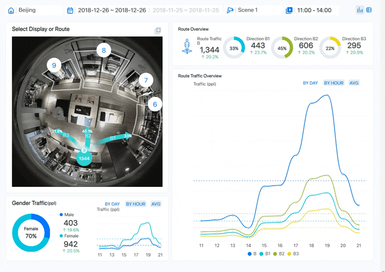
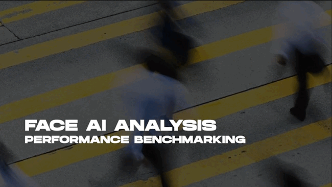
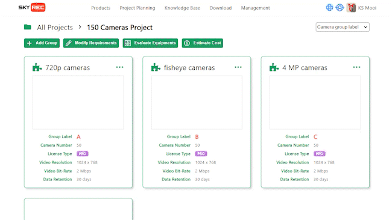

[ English ] [ [繁體中文](README_zhtw.md) ]

# AI Innovation in Smart Retail and Security Monitoring

During my tenure at SkyREC, I had the privilege of collaborating with a group of creative, passionate, and capable colleagues to develop a series of outstanding works. These works were mainly designed and developed between 2016 and 2022, focusing on utilizing artificial intelligence (AI) technology to provide solutions for smart retail and smart security monitoring.

Behind these solutions lies a deep technological content, including algorithm optimization, MLOps automation, high-performance AI inference server design, cloud architecture design, distributed system architecture design, and subscription system design. Each technical aspect is the result of our team's collective efforts, fully demonstrating our professional expertise and innovative capabilities in the field of AI.

## [AIMS: Cutting-Edge AI Monitoring Solution](aims_solution/aims_ai_features_enus.md)

&nbsp;&nbsp;&nbsp;

AIMS is the most attractive AI NVR, with extremely comprehensive features to meet the needs of projects of all sizes. AIMS combines AI, BI, VMS, and NVR perfectly to enhance security management efficiency. The new generation AI NVR constitutes a super-smart solution through the following features:
- Powerful AI: Converts image data and interprets surveillance videos through AI
- Quality BI: Structures data and uses charts to find key insights
- Innovative VMS: Manages up to 1,000 hosts and up to 64,000 cameras simultaneously
- Reliable NVR: Supports up to 64 cameras per host
AIMS utilizes existing surveillance equipment to quickly analyze targets such as people, heads, faces, vehicles, motorcycles, and bicycles, achieving high-efficiency specific searches and significantly saving manpower.

[ [Read More](aims_solution/aims_ai_features_enus.md) ] [ [閱讀更多](aims_solution/aims_ai_features_zhtw.md) ]
  

## [Data-Driven Retail Management: Key Metrics and Strategies](aims_solution/aims_bi_reports_enus.md)

&nbsp;&nbsp;&nbsp;

We believe that data speaks, and data collected directly from actual surveillance footage can quickly and easily solve problems for all industries facing different challenges.
AIMS extracts meaningful content from security footage and transforms it into easily interpretable charts with intuitive design, offering more than 20 types of data reports to meet the needs of users across various industries.
Through AIMS, decision-makers, data analysts, operations managers, sales personnel, and marketing managers can easily gain new insights and drive marketing strategies with data to optimize operations.

[ [Read More](aims_solution/aims_bi_reports_enus.md) ] [ [閱讀更多](aims_solution/aims_bi_reports_zhtw.md) ]
  

## [Smart Monitoring: In-Depth Understanding of AIMS Features](aims_solution/aims_vms_features_enus.md)

&nbsp;&nbsp;&nbsp;

AIMS is designed to enhance security operations with advanced tools for managing NVR equipment, cameras, and video clips. It can monitor over 350 sites simultaneously, each with up to 800 cameras, using a distributed architecture for real-time status monitoring and supports P2P and NAT connections for secure operations.

Key features include:
- Intuitive application menu for easy access
- Advanced video focus for real-time layout design
- Map book integrating geographic info with camera locations
- Bookmark feature for easy marking and searching of video clips

These features ensure a user-friendly and powerful monitoring experience.

[ [Read More](aims_solution/aims_vms_features_enus.md) ] [ [閱讀更多](aims_solution/aims_vms_features_zhtw.md) ]
  

## [Exploring the High Precision of AIMS Image Analysis](aims_solution/high_precision_video_analysis_enus.md)

&nbsp;&nbsp;&nbsp;

Even under extreme weather conditions, such as strong sunlight, rainy days, typhoons, or snow, AI NVR can still provide the best image analysis results. It can also handle scenarios where objects move at different speeds simultaneously, like fast-moving vehicles and bicycles alongside slower-moving bodies or faces.

AIMS allows users to quickly and easily manage security systems in various environmental conditions, including:
- Indoor and outdoor
- Daytime and nighttime
- All seasons

[ [Read More](aims_solution/high_precision_video_analysis_enus.md) ] [ [閱讀更多](aims_solution/high_precision_video_analysis_zhtw.md) ]
  

## [Performance Insights: Image Analysis, Indexing, and Recording](aims_solution/performance_insights_enus.md)

&nbsp;&nbsp;&nbsp;

AIMS has self-learning capabilities, eliminating complex steps and enabling precise analysis with simple settings. Artificial intelligence endows AIMS with excellent image analysis capabilities, allowing the system to think, learn, and self-optimize.
Simply frame the area of interest and select target object conditions, and AIMS will automatically complete the remaining settings. Over time, the accuracy of AIMS image analysis will continue to improve, making security system management easier.

[ [Read More](aims_solution/performance_insights_enus.md) ] [ [閱讀更多](aims_solution/performance_insights_zhtw.md) ]
  

## [SkyREC MSP: Combining Subscription Model with Cross-Border E-Commerce](saas_platform/saas_msp_features_enus.md)

&nbsp;&nbsp;&nbsp;

SkyREC MSP (MemberShip Platform) is a robust platform combining subscription models with cross-border e-commerce, delivering advanced AI software services to global enterprises. It offers flexible AIMS software subscriptions, available monthly and annually, with detailed user and setup guides for easy onboarding.

As a cross-border sales platform, SkyREC MSP provides various AI servers and IP cameras to meet different application needs, supported by comprehensive technical information. The platform ensures a seamless purchase process with global logistics and multiple payment options (T/T and credit cards).

SkyREC MSP also features powerful project analysis and planning tools to recommend suitable products and calculate total costs. Its extensive Knowledge Base offers technical documents and user guides, making it an ideal choice for enterprises aiming to enhance their competitiveness and operational efficiency.

[ [Read More](saas_platform/saas_msp_features_enus.md) ] [ [閱讀更多](saas_platform/saas_msp_features_zhtw.md) ]
  

## References
- [Accuracy of Image Analysis](https://www.youtube.com/playlist?list=PLDpP3n1xoc2UpObNph8IKumyIeHBzPPXV)
- [AI Video Surveillance Product Features](https://www.youtube.com/playlist?list=PLDpP3n1xoc2WIwvWOuuh8AkBptcKAFMQP)
- [AIMS Real-Time Monitoring Features](https://www.youtube.com/playlist?list=PLDpP3n1xoc2W3T8XOP0Szit_l8iAjDA5X)
