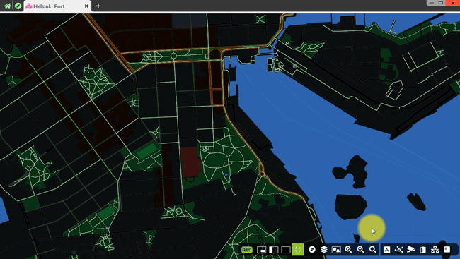

[ English ] [ [繁體中文](README_zhtw.md) ]

# AI Innovation in Smart Retail and Security Monitoring

During my tenure at SkyREC, I had the privilege of collaborating with a group of creative, passionate, and capable colleagues to develop a series of outstanding works. These works were mainly designed and developed between 2016 and 2022, focusing on utilizing artificial intelligence (AI) technology to provide solutions for smart retail and smart security monitoring.

Behind these solutions lies a deep technological content, including algorithm optimization, MLOps automation, high-performance AI inference server design, cloud architecture design, distributed system architecture design, and subscription system design. Each technical aspect is the result of our team's collective efforts, fully demonstrating our professional expertise and innovative capabilities in the field of AI.

## [AIMS: Cutting-Edge AI Monitoring Solution](aims_solution/aims_ai_features_enus.md)

&nbsp;&nbsp;&nbsp;

AIMS is the most attractive AI NVR, with extremely comprehensive features to meet the needs of projects of all sizes. AIMS combines AI, BI, VMS, and NVR perfectly to enhance security management efficiency. The new generation AI NVR constitutes a super-smart solution through the following features:
- Powerful AI: Converts image data and interprets surveillance videos through AI
- Quality BI: Structures data and uses charts to find key insights
- Innovative VMS: Manages up to 1,000 hosts and up to 64,000 cameras simultaneously
- Reliable NVR: Supports up to 64 cameras per host
AIMS utilizes existing surveillance equipment to quickly analyze targets such as people, heads, faces, vehicles, motorcycles, and bicycles, achieving high-efficiency specific searches and significantly saving manpower.

[ [Read More](aims_solution/aims_ai_features_enus.md) ] [ [閱讀更多](aims_solution/aims_ai_features_zhtw.md) ]

## [Data-Driven Retail Management: Key Metrics and Strategies](aims_solution/aims_bi_reports_enus.md)

&nbsp;&nbsp;&nbsp;

We believe that data speaks, and data collected directly from actual surveillance footage can quickly and easily solve problems for all industries facing different challenges.
AIMS extracts meaningful content from security footage and transforms it into easily interpretable charts with intuitive design, offering more than 20 types of data reports to meet the needs of users across various industries.
Through AIMS, decision-makers, data analysts, operations managers, sales personnel, and marketing managers can easily gain new insights and drive marketing strategies with data to optimize operations.

[ [Read More](aims_solution/aims_bi_reports_enus.md) ] [ [閱讀更多](aims_solution/aims_bi_reports_zhtw.md) ]

## [Smart Monitoring: In-Depth Understanding of AIMS Features](aims_solution/aims_vms_features_enus.md)

&nbsp;&nbsp;&nbsp;

AIMS (Smart Monitoring System) is designed to enhance the efficiency and effectiveness of security operations. It integrates various advanced tools and features to help seamlessly manage NVR equipment, cameras, and video clips. AIMS boasts powerful site management capabilities, allowing for the simultaneous monitoring of over 350 sites, each managing up to 800 cameras. The system employs a distributed architecture design, ensuring that the control room can monitor the connection status of all sites in real-time, and supports P2P and NAT connection methods for secure and cost-effective operations. AIMS offers an intuitive application menu, allowing users to quickly find and utilize the applications they need; advanced video focus features that support real-time video layout design and operations; a map book feature that integrates geographic information with camera locations for precise monitoring; and a bookmark feature that simplifies the marking and searching of key video clips. These features of AIMS are designed to provide a more user-friendly and powerful monitoring experience.

[ [Read More](aims_solution/aims_vms_features_enus.md) ] [ [閱讀更多](aims_solution/aims_vms_features_zhtw.md) ]

## [Exploring the High Precision of AIMS Image Analysis](aims_solution/high_precision_video_analysis_enus.md)

&nbsp;&nbsp;&nbsp;

AI NVR allows users to quickly and easily manage security systems in various environmental conditions, including indoor, outdoor, daytime, nighttime, and all seasons.
- Even under extreme weather conditions, such as strong sunlight, rainy days, typhoons, or snow, or when objects move at different speeds simultaneously (e.g., fast-moving vehicles and bicycles, as well as slower-moving bodies or faces), AI NVR can still provide the best image analysis results.
- Indoor and outdoor
- Day and night
- Suitable for all seasons
- Different weather types
- Various moving speeds

[ [Read More](aims_solution/high_precision_video_analysis_enus.md) ] [ [閱讀更多](aims_solution/high_precision_video_analysis_zhtw.md) ]

## [Performance Insights: Image Analysis, Indexing, and Recording](aims_solution/performance_insights_enus.md)

&nbsp;&nbsp;&nbsp;

AIMS has self-learning capabilities, eliminating complex steps and enabling precise analysis with simple settings. Artificial intelligence endows AIMS with excellent image analysis capabilities, allowing the system to think, learn, and self-optimize.
Simply frame the area of interest and select target object conditions, and AIMS will automatically complete the remaining settings. Over time, the accuracy of AIMS image analysis will continue to improve, making security system management easier.

[ [Read More](aims_solution/performance_insights_enus.md) ] [ [閱讀更多](aims_solution/performance_insights_zhtw.md) ]

## [SkyREC MSP: Combining Subscription Model with Cross-Border E-Commerce](saas_solution/saas_msp_features_enus.md)

&nbsp;&nbsp;&nbsp;

SkyREC MSP (MemberShip Platform) is a powerful platform that combines the subscription model with cross-border e-commerce, providing advanced AI software services to global enterprises. It features flexible AIMS software subscription functions, offering monthly and annual subscription options, and includes detailed user guides and setup guides to help users get started quickly. As a cross-border sales platform, SkyREC MSP offers various specifications and levels of AI servers and IP cameras, covering different application scenarios and providing detailed technical information. The platform supports global logistics and multiple payment methods (such as T/T and credit cards), ensuring a convenient and secure purchase process. Additionally, SkyREC MSP has powerful project analysis and planning tools that recommend the most suitable products based on specific needs and calculate the total cost. Its Knowledge Base provides comprehensive technical documents and user guides, ensuring users receive adequate support throughout their usage, making it an ideal choice for enterprises to enhance their competitiveness and operational efficiency.

[ [Read More](saas_platform/saas_msp_features_enus.md) ] [ [閱讀更多](saas_platform/saas_msp_features_zhtw.md) ]

