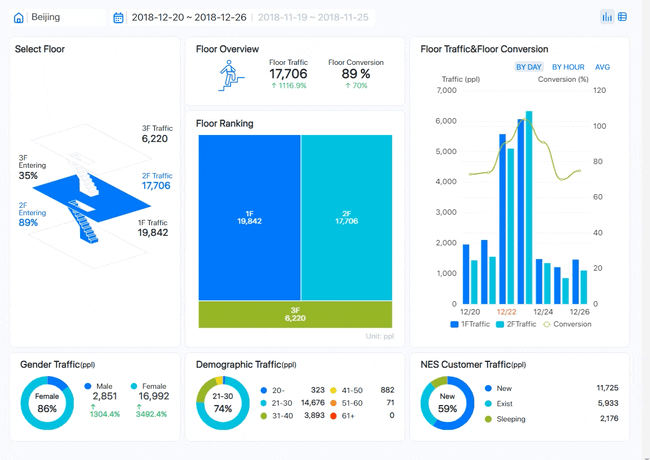
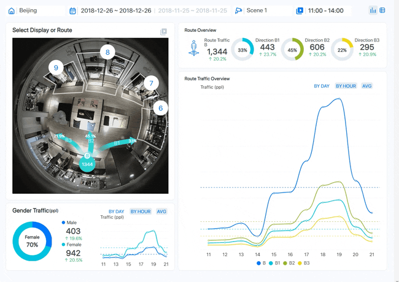
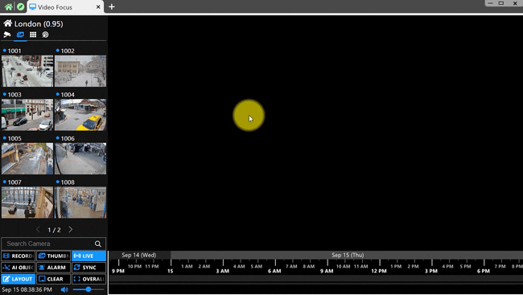
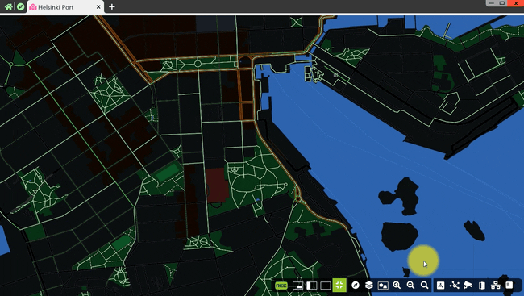
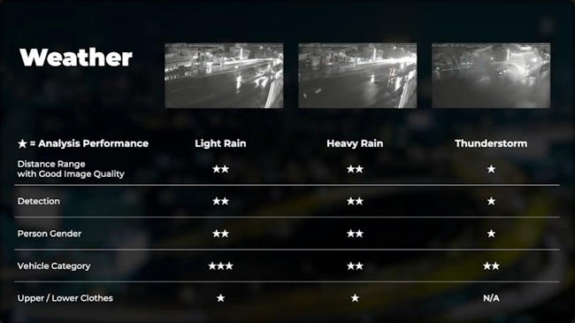
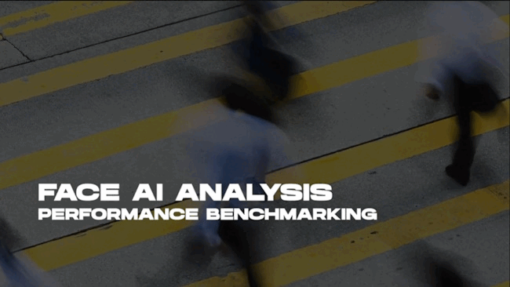
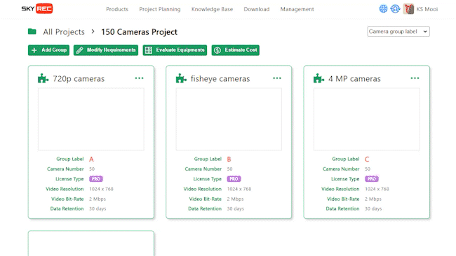

[ [English](README.md) ] [ 繁體中文 ]

# 智慧零售 與 安全監控 的 AI 創新之路

在 SkyREC 任職期間，我有幸與一群充滿創意、熱誠與實力的伙伴們，共同研發出一系列出色的作品。這些作品主要於 2016 至 2022 年間設計與開發，重點在於運用人工智慧 (AI) 技術，提供智慧零售與智慧安全監控的解決方案。

這些解決方案的背後，蘊含著高深的技術內涵，包括演算法優化、MLOps 自動化、高性能 AI 推理伺服器設計、雲端架構設計、分散系統架構設計，以及訂閱系統設計等。每一個技術環節，都是我們團隊共同努力的成果，充分展現了我們在 AI 領域的專業素養與創新能力。

 

## [AIMS：尖端 AI 監控解決方案](aims_solution/aims_ai_features_zhtw.md)

&nbsp;&nbsp;&nbsp;

AIMS 是最具吸引力的 AI NVR，具備極其完備的功能，可滿足各種大小規模的專案需求。AIMS 將 AI、BI、VMS 及 NVR 完美結合，提升安防管理效率。新一代 AI NVR，透過以下功能構成超智慧的解決方案：
- 強大的 AI: 將影像數據化，透過AI解讀監控錄影
- 優質的 BI: 將數據結構化，利用圖表找出關鍵觀點
- 創新的 VMS: 可同時管理高達 1,000 台主機，高達 64,000 支攝影機
- 可靠的 NVR: 一台主機最多可支援 64 支攝影機
AIMS 利用現有監控設備來快速分析包含人、頭部、臉部、車輛、機車及腳踏車等目標物，實現高效率的特定檢索，並大幅節省人力。

[ [Read More](aims_solution/aims_ai_features_enus.md) ] [ [閱讀更多](aims_solution/aims_ai_features_zhtw.md) ]
 

## [以數據為導向的零售管理：關鍵指標和策略](aims_solution/aims_bi_reports_zhtw.md)

&nbsp;&nbsp;&nbsp;

我們相信數據會說話，而直接從實際監控影片中所收集的數據，將可以為面臨不同挑戰的所有行業快速又輕鬆地解決問題。
AIMS 從安防錄影中提取有意義的內容，並以直觀的設計將其轉換成能輕鬆解讀的圖表，提供 20 多種類型的數據報告，以滿足各行各業的用戶需求。
透過 AIMS，無論是決策者、數據分析師、營運主管、銷售人員還是行銷經理，都能輕鬆地獲得新見解，用數據驅動行銷戰略以優化營運。

[ [Read More](aims_solution/aims_bi_reports_enus.md) ] [ [閱讀更多](aims_solution/aims_bi_reports_zhtw.md) ]
 

## [智能監控：深入了解 AIMS 的功能](aims_solution/aims_vms_features_zhtw.md)

&nbsp;&nbsp;&nbsp;

AIMS（智能監控系統）專為提升安防操作的效率和效果而設計。它整合了多種先進工具和功能，幫助無縫管理 NVR 設備、攝像機和視頻片段。AIMS 具備強大的站點管理功能，可以同時監控超過 350 個站點，每個站點最多可管理 800 支攝像機。系統採用分散式架構設計，確保中控室能即時掌握所有站點的連線狀態，並支援 P2P 和 NAT 連線方式，確保安全且具成本效益。AIMS 提供直觀的應用程序菜單，方便用戶快速找到並利用所需應用；先進的視頻聚焦功能，支持實時視頻佈局設計和操作；地圖書功能，整合地理信息與攝像機位置，提供精確監控；以及書籤功能，簡化了標記和搜索關鍵視頻片段的過程。AIMS 的這些特性旨在提供一個更用戶友好且強大的監控體驗。

[ [Read More](aims_solution/aims_vms_features_enus.md) ] [ [閱讀更多](aims_solution/aims_vms_features_zhtw.md) ]
 

## [AIMS 影像分析的高精準度探索](aims_solution/high_precision_video_analysis_zhtw.md)

&nbsp;&nbsp;&nbsp;

AI NVR使用戶能夠快速、輕鬆地實現室內、室外、日間、夜間、四季等各種環境條件下的安防系統管理。
- 即使在極端天氣條件下，如強烈陽光、下雨天、颱風或下雪，或是物體同時以不同速度移動時（如同時有快速移動的汽機車及腳踏車，以及移動較慢的人體或人臉）， AI NVR 都仍可以為用戶提供最佳的影像分析結果。
- 室內和室外
- 白天和黑夜
- 四季皆宜
- 不同類型的天氣
- 各種移動速度

[ [Read More](aims_solution/high_precision_video_analysis_enus.md) ] [ [閱讀更多](aims_solution/high_precision_video_analysis_zhtw.md) ]
 

## [性能洞察：影像分析、索引和錄製](aims_solution/performance_insights_zhtw.md)

&nbsp;&nbsp;&nbsp;

AIMS 擁有自我學習能力，省去繁雜步驟，簡易設定即可進行精準分析。人工智能賦予 AIMS 卓越的影像分析功能，使系統能夠思考、學習和自我優化。
只需框選感興趣的區域，選擇目標對象條件，AIMS 便會自動完成其他設定工作。隨著使用時間增加，AIMS 的影像分析準確度將不斷提高，讓安防系統的管理變得更加輕鬆。

[ [Read More](aims_solution/performance_insights_enus.md) ] [ [閱讀更多](aims_solution/performance_insights_zhtw.md) ]
 

## [SkyREC MSP：訂閱模式與跨境電商的結合](saas_solution/saas_msp_features_zhtw.md)

&nbsp;&nbsp;&nbsp;

SkyREC MSP (MemberShip Platform) 是一個結合訂閱模式與跨境電商的強大平台，專為全球企業提供先進的 AI 軟體服務。它擁有靈活多樣的 AIMS 軟體訂閱功能，提供月訂閱和年訂閱選項，並配有詳細的使用指南和設置指南，幫助用戶快速上手。作為跨境銷售平台，SkyREC MSP 提供多種規格與等級的 AI 伺服器和 IP 攝像頭，涵蓋不同應用場景，並提供詳細的技術資料。該平台支持全球物流配送和多種支付方式（如 T/T 和信用卡），確保購買過程便利且安全。此外，SkyREC MSP 擁有強大的專案分析與規劃工具，能根據具體需求推薦最合適的產品並計算總成本。其 Knowledge Base 提供全面的技術文件和使用者指南，保障用戶在使用過程中得到充分的支持，成為企業提升競爭力和運營效率的理想選擇。

[ [Read More](saas_platform/saas_msp_features_enus.md) ] [ [閱讀更多](saas_platform/saas_msp_features_zhtw.md) ]
 

