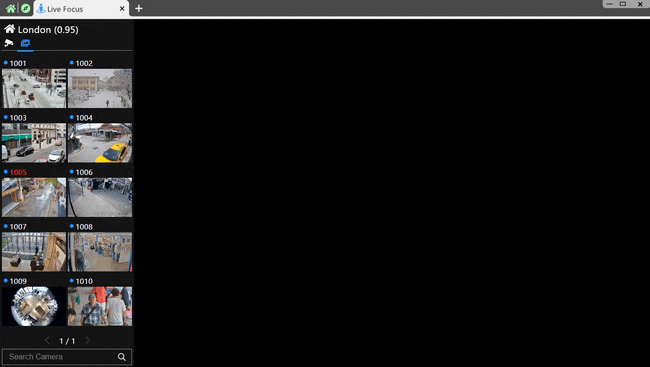
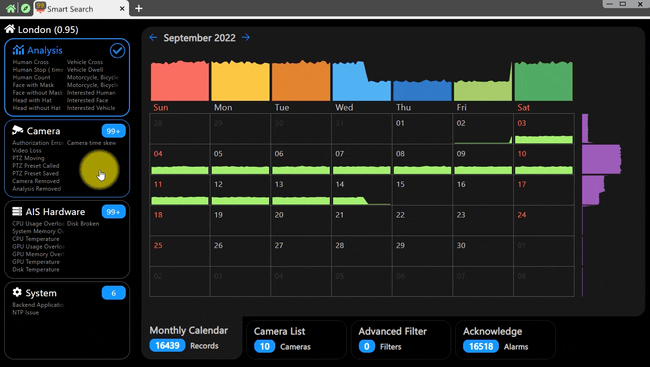

[ [English](aims_ai_features_enus.md) ] [ 繁體中文 ]

# AIMS：尖端 AI 監控解決方案

## 簡介
AI 通常被認為是視頻安全管理的一項昂貴投資，使用者通常需要為每個 AI 分析功能付費或支付額外的升級費用。然而，使用 AiMS，使用者只需支付訂閱許可費，即可全年享受所有 AI 分析功能的免費升級。

AiMS 提供全面的 AI 驅動分析，包括：

- **面部分析**：識別性別、年齡和口罩使用情況。
- **人員分析**：分析性別、上衣類型和顏色、下衣類型和顏色。
- **車輛分析**：分類車輛類型和顏色。
- **帽子分析**：檢測帽子、鴨舌帽和頭盔。
- **上傳圖片搜索分析**：根據上傳的圖片搜索面部、車輛、服裝和帽子。

AiMS 使使用者能夠利用多種視頻應用程序進行先進和全面的安全管理。主要功能包括：

- **Live Focus (即時聚焦)**：即時物件檢測。
- **Object Search (物件搜索)**：快速搜索 5 種以上的物件。
- **Object Recognition (物件識別)**：識別 16 種以上的物件。
- **Image Search (圖像搜索)**：對目標物件進行反向圖像搜索。
- **Smart Search (智能搜索)**：使用 AI 事件警報進行靈活搜索。
- **Object Playback (物件回放)**：同步回放目標物件。

使用 AiMS，使用者可以實現視頻安全管理的新水平，確保穩健和動態的監控能力。

## Live Focus

### 功能演示

**即時監控多支攝影機的物件偵測結果**

 

**即時檢示物件偵測的統計結果**

 

### 功能特色
即時聚焦允許即時檢測和追踪各種物件，如車輛、行人和自行車。系統會捕捉並突出顯示這些物件，為使用者提供即時且準確的監控區域分析。這對於交通管理和安全監控至關重要，使得對動態情況的有效監控和回應成為可能。即時聚焦還包含動態數據可視化功能，根據檢測到的物件生成即時圖表。這些可視化數據幫助使用者快速解釋和理解監控區域內的物件流動和分佈，通過提供清晰簡潔的視覺見解來增強決策。

## Object Playback

### 功能演示

**同時搜尋與回播三個物件的影片**

 

**同時搜尋與回播一個物件的影片**

 

### 功能特色
物件回放使使用者能夠基於檢測到的物件提取關鍵視頻片段，節省時間和精力，僅關注相關的畫面。系統突出顯示並允許快速訪問重要時刻，確保在不需要篩選不必要視頻數據的情況下進行高效的審查和分析。物件回放能夠精確跟踪目標物件在視頻中的路徑。這一功能幫助使用者從頭到尾跟踪特定物件的移動和行為，為更好的分析和決策提供清晰詳細的見解。

## Object Search

### 功能演示

**搜尋屬於人臉的物件**

 

**搜尋屬於人物的物件**

 

**搜尋屬於汽車的物件**

 

### 功能特色
物件搜索允許使用者通過設置自定義參數（如時間段、幀範圍和物件類型）快速定位視頻流中的特定物件。此功能顯著提高了視頻分析的效率，使得能夠有針對性地搜索，無需手動掃描大量視頻錄像即可輕鬆找到相關畫面。

## Face Recognition

### 功能演示

**以性別為條件來搜尋相似的物件**

 

**以口罩為條件來搜尋相似的物件**

 

**以人臉圖片來搜尋相似的物件**

 

**以戴口罩人臉圖片來搜尋相似的物件**

 

### 功能特色
面部識別允許使用者在特定時間段內快速搜索和識別個人，基於面部屬性進行識別。通過自定義參數（如時間範圍、攝像頭圖像和物件屬性），使用者可以有效地找到符合特定標準的面孔，如性別、年齡、是否戴口罩和種族。此外，系統支持上傳圖像進行精確目標搜索，使其成為安全和監控應用的強大工具。

## Apparel Recognition

### 功能演示

**以衣著性別來搜尋相似的物件**

 

**以衣著顏色來搜尋相似的物件**

 

**以人物外型圖片來搜尋相似的物件**

 

### 功能特色
服裝識別允許使用者根據服裝屬性迅速搜索個人。通過設置關鍵條件（如性別、服裝類型和顏色），此功能提高了定位和追踪目標的效率。使用者還可以上傳圖像來找到相似的服裝匹配，使其成為各種監控場景中識別個人的必備工具。

## Vehicle Recognition

### 功能演示

**以汽車顏色條件來搜尋相似的物件**

 

**以車種條件來搜尋相似的物件**

 

**以汽車圖片來搜尋相似的物件**

 

### 功能特色
車輛識別允許使用者根據不同屬性在指定的時間範圍內快速且準確地搜索車輛。通過選擇車輛類型和顏色等特徵，使用者可以高效地在視頻流中定位目標車輛。此外，系統支持上傳圖片進行精確車輛搜索，成為交通監控和安全執法中的寶貴工具。

## Smart Search

### 功能演示

**四個重要的訊息分類**

 

**透過日歷來使用 Smart Search**

 

### 功能特色
智能搜索功能通過將警報分類為分析、攝像機、AIS 硬件和系統問題，提供全面的警報管理。日曆視圖顯示每月警報趨勢，使得容易識別頻繁異常的時間段。此功能允許使用者高效地監控和管理安全事件，確保快速響應潛在問題，並根據歷史警報數據優化資源分配。

## 結論
AiMS 通過使先進的 AI 分析變得可及且實惠，徹底改變了視頻安全管理。通過簡單的訂閱許可，使用者可以全面訪問強大的 AI 驅動功能套件，無需支付昂貴的單項功能和升級費用。

AiMS 提供的多樣化分析——涵蓋面

部、人員、車輛、帽子和上傳圖片搜索——確保使用者能夠以無與倫比的精度和效率管理和分析視頻數據。即時聚焦、物件搜索、物件識別、圖像搜索、智能搜索和物件回放等主要功能增強了監控、搜索和審查安全畫面的能力。

AiMS 使使用者能夠最大限度地利用其視頻應用程序，實現先進和全面的安全管理。這一創新方法不僅提高了運營效率，還加強了整體安全措施，提供可靠和動態的監控解決方案。

AiMS 是 AI 與視頻管理系統集成潛力的見證，提供簡化、具成本效益和強大的現代安全需求工具。

