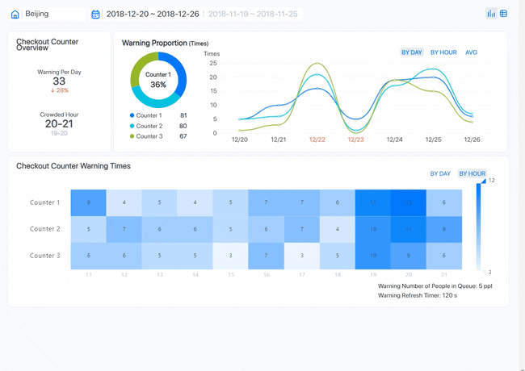
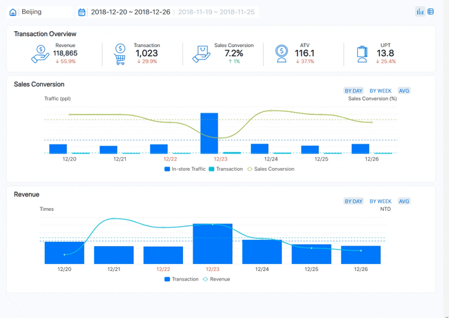
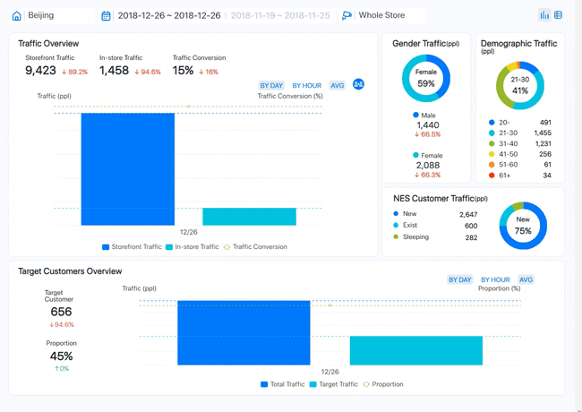
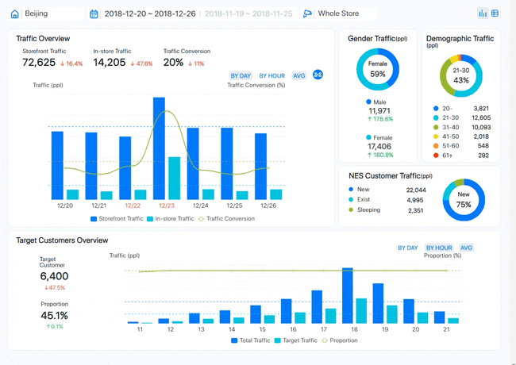
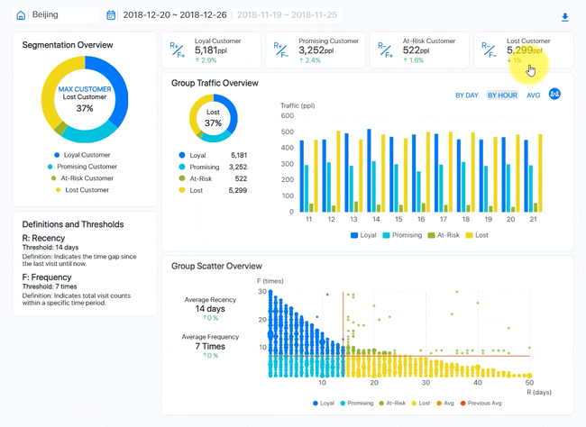

[ English ] [ [繁體中文](aims_bi_reports_zhtw.md) ]

# Data-Driven Retail Management: Key Metrics and Strategies

## Introduction
Retail store managers need comprehensive and actionable insights to optimize store performance, enhance customer experience, and boost sales. This document presents a series of dashboards that provide a detailed analysis of various aspects of retail operations, including checkout counter performance, transaction and revenue analysis, in-store display efficiency, route traffic, and customer behavior. Additionally, it delves into customer segmentation, focusing on loyal, promising, at-risk, and lost customers. By leveraging these dashboards, managers can make data-driven decisions to improve store layout, target marketing efforts, and retain valuable customers.

## 1. Traffic and Conversion Tracking

### Purpose and Usage

These dashboards are used by retail store managers to monitor and analyze store performance. They provide a comprehensive overview of key metrics, enabling data-driven decisions to improve operations, customer experience, and sales. The dashboards help identify trends, strengths, and areas for improvement by visualizing traffic data, fitting room usage, and transaction details.

### Chart Elements

| Chart Element               | Description                                                                                           |
|-----------------------------|-------------------------------------------------------------------------------------------------------|
| **Window Display Overview** | Tracks the number of people who viewed the window display and the average time spent by each viewer.  |
| **Store Traffic Overview**  | Monitors the number of people entering the store (storefront traffic), those staying inside (instore traffic), and the conversion rate (percentage of visitors who made a purchase). |
| **Fitting Room Overview**   | Shows the number of times fitting rooms were used and the percentage of time they were occupied.      |
| **Transaction Overview**    | Provides data on total sales (revenue), number of sales transactions, sales conversion rate, average transaction value (ATV), and units per transaction (UPT). |
| **Display Ranking**         | Ranks window displays based on the traffic they attracted.                                            |
| **Fitting Room Overview (by floor)** | Breaks down fitting room usage by different floors.                                               |
| **Checkout Counter Overview** | Displays the number of transactions handled by each checkout counter.                                     |
| **3D Store Layout Visualization** | Offers a visual representation of the store layout, highlighting areas of interest.                             |

## 2. Checkout Counter Performance Analysis

### Purpose and Usage
This dashboard is used by retail store managers to monitor the performance of checkout counters. It helps identify peak times, crowding issues, and the efficiency of different counters. By analyzing this data, managers can optimize staff allocation, improve customer service, and reduce wait times.

### Chart Elements

| Element                          | Description                                                                                           |
|----------------------------------|-------------------------------------------------------------------------------------------------------|
| **Checkout Counter Overview**    | Shows the average number of warnings per day, indicating times when there were more than 5 people in queue. Highlights the most crowded hour. |
| **Warning Proportion (Times)**   | Pie chart displaying the proportion of warnings by each checkout counter, showing which counter had the most alerts. |
| **Warning Times Trend (By Day/Hour)** | Line chart illustrating the trend of warning times throughout the week, broken down by day and hour, showing peak crowding times. |
| **Checkout Counter Warning Times** | Heatmap depicting the number of warnings per hour for each checkout counter, providing a detailed view of peak hours for crowding. |

## 3. Transaction and Revenue Analysis

### Purpose and Usage
This dashboard is designed for retail store managers to monitor and analyze sales performance. It provides insights into transaction volume, sales conversion rates, average transaction values, and overall revenue. By examining these metrics, managers can identify trends, evaluate promotional effectiveness, and make informed decisions to enhance sales strategies.

### Chart Elements

| Element                      | Description                                                                                           |
|------------------------------|-------------------------------------------------------------------------------------------------------|
| **Transaction Overview**     | Summary of key metrics including total revenue, number of transactions, sales conversion rate, average transaction value (ATV), and units per transaction (UPT). |
| **Sales Conversion**         | Bar and line chart showing in-store traffic, number of transactions, and sales conversion rate over time. Indicates how traffic translates into sales. |
| **Revenue**                  | Bar and line chart depicting transaction counts and total revenue over the specified period. Highlights daily and weekly trends in sales performance. |

## 4. In-Store Display and Traffic Analysis

### Purpose and Usage
This dashboard is utilized by retail store managers to analyze the effectiveness of in-store displays and customer traffic patterns. It provides detailed insights into how customers interact with different displays, including dwell time, route traffic, and gender-based traffic analysis. This information helps managers optimize display placements, improve customer engagement, and enhance overall store layout efficiency.

### Chart Elements

| Element                      | Description                                                                                           |
|------------------------------|-------------------------------------------------------------------------------------------------------|
| **Select Display or Route**  | Interactive visual representation of the store layout showing different display areas and routes, helping identify high-traffic zones. |
| **Display Overview - B02**   | Metrics for a specific display, including dwell traffic, average dwell time per person, route traffic, and dwell conversion rate. |
| **Dwell Traffic Overview**   | Bar and line chart showing the distribution of in-store traffic, route traffic, dwell traffic, and dwell conversion over time. |
| **Gender Traffic**           | Pie chart and line chart showing the distribution of male and female traffic in the store, along with hourly traffic trends. |
| **Display Efficiency**       | Bar and line chart illustrating the efficiency of the display in terms of dwell traffic and average dwell time per person, broken down by day and hour. |

## 5. Route Traffic and Customer Behavior Analysis

### Purpose and Usage
This dashboard is designed for retail store managers to analyze customer movement and behavior within the store. It provides insights into the most frequented routes, gender distribution of traffic, and detailed traffic patterns by direction and time. This data helps managers optimize store layout, improve product placements, and enhance overall customer experience.

### Chart Elements

| Element                      | Description                                                                                           |
|------------------------------|-------------------------------------------------------------------------------------------------------|
| **Select Display or Route**  | Interactive visual representation of the store layout highlighting different display areas and main customer routes. |
| **Route Overview**           | Metrics for overall route traffic, including the number of people moving through specific directions (B1, B2, B3) and their respective percentages. |
| **Route Traffic Overview**   | Line chart showing the distribution of route traffic over time, broken down by specific directions, providing a detailed view of customer flow. |
| **Gender Traffic**           | Pie chart and line chart showing the gender distribution of traffic (male and female) and traffic trends over time, highlighting peak times for each gender. |

## 6. Window Display Traffic and Efficiency Analysis

### Purpose and Usage
This dashboard is used by retail store managers to analyze the performance and efficiency of window displays. It provides insights into how window displays attract traffic, convert viewers into store visitors, and the overall effectiveness of different displays. This information helps managers optimize display arrangements to maximize customer engagement and store traffic.

### Chart Elements

| Element                         | Description                                                                                           |
|---------------------------------|-------------------------------------------------------------------------------------------------------|
| **Select Window Display**       | Interactive visual representation showing different window displays and their corresponding traffic metrics. |
| **Window Display Efficiency**   | Bar and line chart illustrating the efficiency of window displays in terms of storefront traffic, in-store traffic, dwell traffic, and window-in traffic over time. |
| **Window Display Conversion**   | Metrics for overall window display performance, including storefront traffic, conversion rate, dwell traffic, and window-in traffic. |
| **Window Display Overview**     | Bar and line chart showing detailed metrics for dwell traffic and average dwell time per person, broken down by day and hour. |

## 7. Floor Traffic and Demographic Analysis

### Purpose and Usage
This dashboard is used by retail store managers to analyze customer traffic and demographics across different floors of the store. It provides insights into how different floors attract and convert traffic, the demographic breakdown of visitors, and the overall efficiency of each floor in engaging customers. This data helps managers optimize store layout, tailor marketing strategies, and improve customer experience.

### Chart Elements

| Element                          | Description                                                                                           |
|----------------------------------|-------------------------------------------------------------------------------------------------------|
| **Select Floor**                 | Interactive visual representation of the store layout showing traffic distribution across different floors. |
| **Floor Overview**               | Summary of key metrics including total floor traffic and floor conversion rate, indicating the effectiveness of each floor in attracting and converting visitors. |
| **Floor Ranking**                | Visual ranking of floors based on traffic, highlighting the most and least visited floors.            |
| **Floor Traffic & Floor Conversion** | Bar and line chart showing traffic and conversion rates for each floor, broken down by day and hour, providing a detailed view of customer flow and engagement. |
| **Gender Traffic**               | Pie chart and line chart showing the gender distribution of traffic (male and female) and traffic trends over time, highlighting peak times for each gender. |
| **Demographic Traffic**          | Bar chart depicting the age distribution of visitors, showing which age groups are most represented in the store traffic. |
| **NES Customer Traffic**         | Pie chart and bar chart showing the distribution of new, existing, and sleeping (inactive) customers, providing insights into customer retention and engagement. |

## 8. Store-Wide Traffic and Customer Analysis

### Purpose and Usage
This dashboard is utilized by retail store managers to analyze overall store traffic and customer demographics. It provides comprehensive insights into storefront and in-store traffic, traffic conversion rates, and the demographic breakdown of visitors. Additionally, it tracks the proportion of new, existing, and sleeping customers. This data aids in optimizing marketing strategies, enhancing customer retention, and improving store layout and services.

### Chart Elements

| Element                          | Description                                                                                           |
|----------------------------------|-------------------------------------------------------------------------------------------------------|
| **Traffic Overview**             | Summary of key metrics including storefront traffic, in-store traffic, and traffic conversion rate. Shows overall performance and customer engagement. |
| **Gender Traffic**               | Pie chart showing the gender distribution of visitors, along with a detailed breakdown of traffic trends over time. |
| **Demographic Traffic**          | Bar chart depicting the age distribution of store visitors, highlighting the most represented age groups. |
| **NES Customer Traffic**         | Pie chart and bar chart showing the distribution of new, existing, and sleeping customers, providing insights into customer retention and engagement. |
| **Target Customers Overview**    | Bar chart showing the traffic and proportion of target customers within the total store traffic, broken down by day and hour. Highlights how well the store attracts its target demographic. |

## 9. Loyal Customer Segmentation and Traffic Analysis

### Purpose and Usage
This dashboard is designed for retail store managers to analyze customer segments, particularly focusing on loyal customers, based on loyalty and visit frequency. It provides insights into customer behavior, highlighting loyal, promising, at-risk, and lost customers. This information helps in tailoring marketing strategies, improving customer retention, and enhancing the overall shopping experience.

### Chart Elements

| Element                         | Description                                                                                           |
|---------------------------------|-------------------------------------------------------------------------------------------------------|
| **Segmentation Overview**       | Pie chart showing the distribution of customer segments: loyal, promising, at-risk, and lost customers. |
| **Definitions and Thresholds**  | Definitions for recency (R) and frequency (F) metrics, including the thresholds used for segmentation. |
| **Group Traffic Overview**      | Bar chart showing traffic data for loyal customers over time, broken down by day and hour.             |
| **Group Scatter Overview**      | Scatter plot showing the relationship between visit frequency (F) and recency (R) for loyal customers, indicating patterns in customer behavior. |

## 10. Promising Customer Segmentation and Traffic Analysis

### Purpose and Usage
This dashboard is designed for retail store managers to analyze customer segments, particularly focusing on promising customers, based on loyalty and visit frequency. It provides insights into customer behavior, highlighting loyal, promising, at-risk, and lost customers. This information helps in tailoring marketing strategies, improving customer retention, and enhancing the overall shopping experience.

### Chart Elements

| Element                         | Description                                                                                           |
|---------------------------------|-------------------------------------------------------------------------------------------------------|
| **Segmentation Overview**       | Pie chart showing the distribution of customer segments: loyal, promising, at-risk, and lost customers. |
| **Definitions and Thresholds**  | Definitions for recency (R) and frequency (F) metrics, including the thresholds used for segmentation. |
| **Group Traffic Overview**      | Bar chart showing traffic data for promising customers over time, broken down by day and hour.        |
| **Group Scatter Overview**      | Scatter plot showing the relationship between visit frequency (F) and recency (R) for promising customers, indicating patterns in customer behavior. |

## 11. At-Risk and Lost Customer Segmentation and Traffic Analysis

### Purpose and Usage
This dashboard is designed for retail store managers to analyze customer segments, particularly focusing on at-risk and lost customers, based on loyalty and visit frequency. It provides insights into customer behavior, highlighting loyal, promising, at-risk, and lost customers. This information helps in identifying patterns that lead to customer attrition and developing strategies to re-engage and retain at-risk customers.

### Chart Elements

| Element                         | Description                                                                                           |
|---------------------------------|-------------------------------------------------------------------------------------------------------|
| **Segmentation Overview**       | Pie chart showing the distribution of customer segments: loyal, promising, at-risk, and lost customers. |
| **Definitions and Thresholds**  | Definitions for recency (R) and frequency (F) metrics, including the thresholds used for segmentation. |
| **Group Traffic Overview**      | Bar chart showing traffic data for at-risk and lost customers over time, broken down by day and hour. |
| **Group Scatter Overview**      | Scatter plot showing the relationship between visit frequency (F) and recency (R) for at-risk and lost customers, indicating patterns in customer behavior. |

## Conclusion
The series of dashboards presented in this document equips retail store managers with essential insights into various aspects of store operations and customer behavior. By analyzing data from checkout counters, transaction and revenue metrics, in-store displays, and customer traffic patterns, managers can optimize store performance and enhance the customer experience. The segmentation of customers into loyal, promising, at-risk, and lost categories further allows for targeted marketing and retention strategies. Utilizing these dashboards, managers can make informed, data-driven decisions to drive sales, improve efficiency, and foster customer loyalty, ultimately leading to a more successful retail operation.

