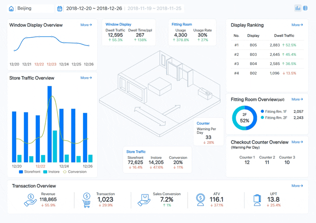
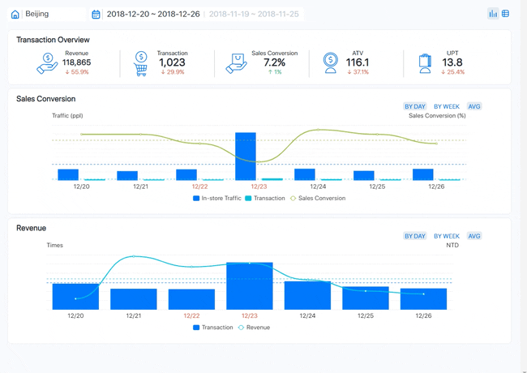
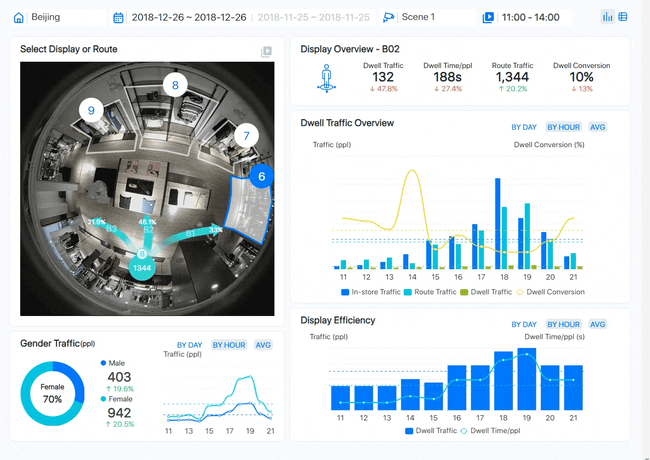
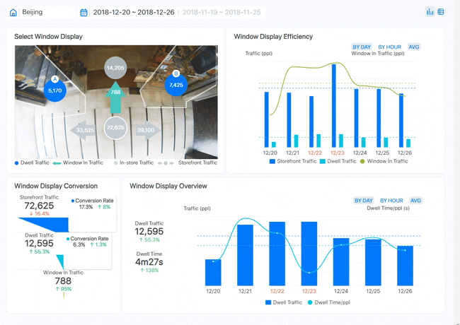
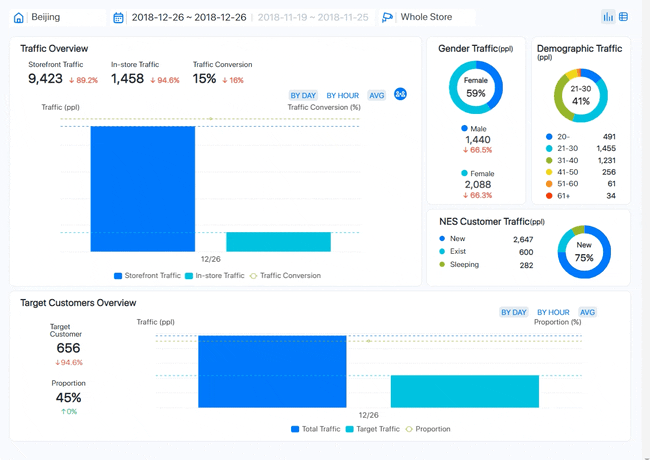
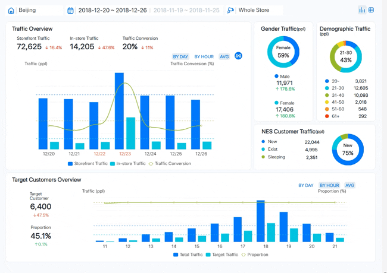
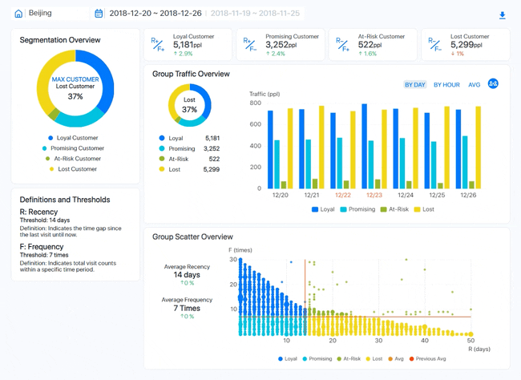
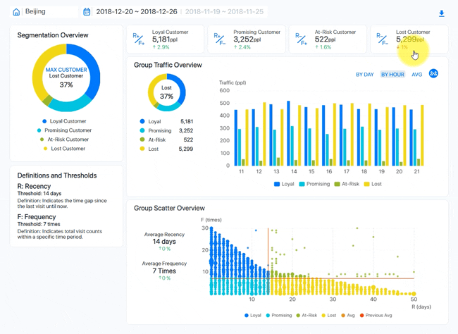

[ [English](aims_bi_reports_enus.md) ] [ 繁體中文 ]

# 以數據為導向的零售管理：關鍵指標和策略

## 簡介
零售店經理需要全面且可操作的見解來優化店鋪表現，提升客戶體驗並增加銷售量。本文件展示了一系列儀表板，對零售運營的各個方面進行了詳細分析，包括收銀台表現、交易和收入分析、店內展示效率、路線交通和客戶行為。此外，它還深入研究了客戶細分，重點關注忠實客戶、有潛力的客戶、風險客戶和流失客戶。通過利用這些儀表板，經理們可以做出數據驅動的決策，以改善店鋪佈局、針對性行銷和保持有價值的客戶。

## 1. 流量和轉換追踪

### 目的和用途

這些儀表板供零售店經理使用，以監控和分析店鋪表現。它們提供關鍵指標的全面概覽，使得數據驅動的決策能夠改善運營、客戶體驗和銷售。通過可視化流量數據、更衣室使用情況和交易詳細信息，這些儀表板有助於識別趨勢、優勢和需要改進的地方。

### 圖表元素

| Chart Element               | Description                                                                                           |
|-----------------------------|-------------------------------------------------------------------------------------------------------|
| **Window Display Overview** | 追踪查看橱窗展示的人數及每位查看者的平均停留時間。  |
| **Store Traffic Overview**  | 監控進入店鋪的人數（店面流量）、留在店內的人數（店內流量）及轉換率（購買的訪客百分比）。 |
| **Fitting Room Overview**   | 顯示更衣室使用次數及其被佔用的百分比。      |
| **Transaction Overview**    | 提供總銷售額（收入）、交易數量、銷售轉換率、平均交易價值（ATV）及每次交易的單位數量（UPT）數據。 |
| **Display Ranking**         | 根據吸引的流量對展示進行排名。                                            |
| **Fitting Room Overview (by floor)** | 按樓層細分更衣室使用情況。                                               |
| **Checkout Counter Overview** | 顯示每個收銀台處理的交易數量。                                     |
| **3D Store Layout Visualization** | 提供店鋪佈局的可視化表示，突顯關注區域。                             |

## 2. 收銀台表現分析

### 目的和用途
這個儀表板供零售店經理使用，以監控收銀台的表現。它有助於識別高峰時段、擁擠問題和不同收銀台的效率。通過分析這些數據，經理可以優化員工分配，改善客戶服務，減少等待時間。

### 圖表元素

| Element                          | Description                                                                                           |
|----------------------------------|-------------------------------------------------------------------------------------------------------|
| **Checkout Counter Overview**    | 顯示每日警告的平均次數，指示隊列中有超過5人的時間。突顯最擁擠的時段。 |
| **Warning Proportion (Times)**   | 圓餅圖顯示每個收銀台的警告比例，指示哪個收銀台有最多警告。 |
| **Warning Times Trend (By Day/Hour)** | 折線圖展示了一周內的警告時間趨勢，按天和小時細分，顯示擁擠的高峰時間。 |
| **Checkout Counter Warning Times** | 熱圖顯示每個收銀台每小時的警告次數，提供擁擠高峰時間的詳細視圖。 |

## 3. 交易和收入分析

### 目的和用途
這個儀表板為零售店經理設計，用於監控和分析銷售表現。它提供了交易量、銷售轉換率、平均交易價值和總收入的見解。通過檢查這些指標，經理可以識別趨勢，評估促銷效果，並做出明智的決策來加強銷售策略。

### 圖表元素

| Element                      | Description                                                                                           |
|------------------------------|-------------------------------------------------------------------------------------------------------|
| **Transaction Overview**     | 關鍵指標摘要，包括總收入、交易數量、銷售轉換率、平均交易價值（ATV）和每次交易的單位數量（UPT）。 |
| **Sales Conversion**         | 條形圖和折線圖展示了店內流量、交易數量和銷售轉換率隨時間變化的情況。指示流量如何轉化為銷售。 |
| **Revenue**                  | 條形圖和折線圖描述了指定期間內的交易數量和總收入。突顯每日和每週的銷售表現趨勢。 |

## 4. 店內展示和流量分析

### 目的和用途
這個儀表板供零售店經理使用，以分析店內展示的有效性和顧客流量模式。它提供了顧客與不同展示互動的詳細見解，包括停留時間、路線流量和性別流量分析。這些信息幫助經理優化展示佈置，提高顧客參與度，提升整體店鋪佈局效率。

### 圖表元素

| Element                      | Description                                                                                           |
|------------------------------|-------------------------------------------------------------------------------------------------------|
| **Select Display or Route**  | 店鋪佈局的互動可視化表示，展示不同的展示區域和路線，幫助識別高流量區域。 |
| **Display Overview - B02**   | 具體展示的指標，包括停留流量、每人平均停留時間、路線流量和停留轉換率。 |
| **Dwell Traffic Overview**   | 條形圖和折線圖顯示了隨時間變化的店內流量、路線流量、停留流量和停留轉換率的分佈。 |
| **Gender Traffic**           | 圓餅圖和折線圖顯示了店內男性和女性流量的分佈及每小時流量趨勢。 |
| **Display Efficiency**       | 條形圖和折線圖說明了展示在停留流量和每人平均停留時間方面的效率，按天和小時細分。 |

## 5. 路線交通和客戶行為分析

### 目的和用途
這個儀表板為零售店經理設計，用於分析店內顧客的移動和行為。它提供了最常見路線、流量性別分佈及按方向和時間詳細的流量模式的見解。這些數據有助於經理優化店鋪佈局，改進產品擺放，提升整體顧客體驗。

### 圖表元素

| Element                      | Description                                                                                           |
|------------------------------|-------------------------------------------------------------------------------------------------------|
| **Select Display or Route**  | 店鋪佈局的互動可視化表示，突顯不同的展示區域和主要顧客路線。 |
| **Route Overview**           | 總體路線流量的指標，包括經過特定方向（B1, B2, B3）的人數及其相應的百分比。 |
| **Route Traffic Overview**   | 折線圖顯示了按具體方向細分的路線流量隨時間變化的分佈，提供顧客流量的詳細視圖。 |
| **Gender Traffic**           | 圓餅圖和折線圖顯示了流量的性別分佈（男性和女性）及流量隨時間變化的趨勢，突顯每個性別的高峰時間。 |

## 6. 櫥窗展示流量和效率分析

### 目的和用途
這個儀表板供零售店經

理使用，以分析櫥窗展示的表現和效率。它提供了櫥窗展示如何吸引流量、將觀眾轉化為店內訪客以及不同展示的整體效果的見解。這些信息幫助經理優化展示佈局，以最大限度地提高顧客參與度和店內流量。

### 圖表元素

| Element                         | Description                                                                                           |
|---------------------------------|-------------------------------------------------------------------------------------------------------|
| **Select Window Display**       | 互動可視化表示展示不同的櫥窗展示及其相應的流量指標。 |
| **Window Display Efficiency**   | 條形圖和折線圖說明了櫥窗展示在店面流量、店內流量、停留流量和櫥窗內流量方面的效率，隨時間變化。 |
| **Window Display Conversion**   | 整體櫥窗展示表現的指標，包括店面流量、轉換率、停留流量和櫥窗內流量。 |
| **Window Display Overview**     | 條形圖和折線圖顯示了詳細的停留流量和每人平均停留時間指標，按天和小時細分。 |

## 7. 樓層流量和人口統計分析

### 目的和用途
這個儀表板供零售店經理使用，以分析不同樓層的顧客流量和人口統計數據。它提供了各樓層如何吸引和轉化流量、訪客的人口統計細分及每層樓的整體效率見解。這些數據有助於經理優化店鋪佈局，針對性地制定行銷策略，提升顧客體驗。

### 圖表元素

| Element                          | Description                                                                                           |
|----------------------------------|-------------------------------------------------------------------------------------------------------|
| **Select Floor**                 | 互動可視化表示店鋪佈局，展示不同樓層的流量分佈。 |
| **Floor Overview**               | 關鍵指標摘要，包括總樓層流量和樓層轉換率，指示各樓層在吸引和轉化訪客方面的效率。 |
| **Floor Ranking**                | 根據流量對樓層進行排名，突顯最受歡迎和最不受歡迎的樓層。 |
| **Floor Traffic & Floor Conversion** | 條形圖和折線圖顯示了每層樓的流量和轉換率，按天和小時細分，提供顧客流量和參與度的詳細視圖。 |
| **Gender Traffic**               | 圓餅圖和折線圖顯示了流量的性別分佈（男性和女性）及流量隨時間變化的趨勢，突顯每個性別的高峰時間。 |
| **Demographic Traffic**          | 條形圖描繪了訪客的年齡分佈，顯示哪些年齡組在店鋪流量中最為顯著。 |
| **NES Customer Traffic**         | 圓餅圖和條形圖顯示了新客戶、現有客戶和睡眠（不活躍）客戶的分佈，提供客戶保留和參與的見解。 |

## 8. 全店流量和客戶分析

### 目的和用途
這個儀表板供零售店經理使用，以分析整體店鋪流量和客戶人口統計數據。它提供了店面和店內流量、流量轉換率及訪客人口統計細分的全面見解。此外，它還跟踪了新客戶、現有客戶和睡眠客戶的比例。這些數據有助於優化行銷策略、提升客戶保留率及改進店鋪佈局和服務。

### 圖表元素

| Element                          | Description                                                                                           |
|----------------------------------|-------------------------------------------------------------------------------------------------------|
| **Traffic Overview**             | 關鍵流量指標摘要，包括店面流量、店內流量和流量轉換率。顯示店鋪整體表現和客戶參與情況。 |
| **Gender Traffic**               | 圓餅圖顯示訪客的性別分佈，並詳細說明男性和女性流量的趨勢。 |
| **Demographic Traffic**          | 條形圖描繪了訪客的年齡分佈，突顯了店鋪中最為顯著的年齡組。 |
| **NES Customer Traffic**         | 圓餅圖和條形圖顯示了新客戶、現有客戶和睡眠客戶的分佈，提供客戶保留和參與的見解。 |
| **Target Customers Overview**    | 條形圖顯示了總流量、目標流量及目標客戶在總店鋪流量中的比例，按天和小時細分。幫助了解店鋪吸引目標客群的效果。 |

## 9. 全面店鋪流量和客戶人口統計

### 目的和用途
這個儀表板提供了對整體店鋪流量、客戶人口統計和目標客戶參與的詳細分析。它幫助零售經理了解流量模式、轉換率和客戶的人口統計特徵。這些信息對於優化店鋪佈局、制定行銷策略及提升整體顧客體驗至關重要。

### 圖表元素

| Element                          | Description                                                                                           |
|----------------------------------|-------------------------------------------------------------------------------------------------------|
| **Traffic Overview**             | 關鍵流量指標摘要，包括店面流量、店內流量和流量轉換率。突顯店鋪整體表現和客戶參與情況。 |
| **Gender Traffic**               | 圓餅圖顯示訪客的性別分佈，並詳細說明男性和女性流量的趨勢。 |
| **Demographic Traffic**          | 條形圖描繪了訪客的年齡分佈，突顯了店鋪中最為顯著的年齡組。 |
| **NES Customer Traffic**         | 圓餅圖和條形圖顯示了新客戶、現有客戶和睡眠（不活躍）客戶的分佈，提供客戶保留和參與的見解。 |
| **Target Customers Overview**    | 條形圖顯示了總流量、目標流量及目標客戶在總店鋪流量中的比例，按天和小時細分。幫助了解店鋪吸引目標客群的效果。 |

## 10. 忠實客戶細分和流量分析

### 目的和用途
這個儀表板為零售店經理設計，用於分析客戶細分，特別是關注忠實客戶，基於忠誠度和訪問頻率。它提供了客戶行為的見解，突顯了忠實客戶、有潛力的客戶、風險客戶和流失客戶。這些信息有助於制定行銷策略，提高客戶保留率，提升整體購物體驗。

### 圖表元素

| Element                         | Description                                                                                           |
|---------------------------------|-------------------------------------------------------------------------------------------------------|
| **Segmentation Overview**       | 圓餅圖顯示客戶細分的分佈：忠實客戶、有潛力的客戶、風險客戶和流失客戶。 |
| **Definitions and Thresholds**  | 定義了回訪率（R）和頻率（F）指標及其閾值。 |
| **Group Traffic Overview**      | 條形圖顯示忠實客戶隨時間變化的流量數據，按天和小時細分。 |
| **Group Scatter Overview**      | 散點圖展示了忠實客戶的訪問頻率（F）和回訪率（R）之間的關係，指示客戶行為模式。 |

## 11. 有潛力客戶細分和流量分析

### 目的和用途

這個儀表板為零售店經理設計，用於分析客戶細分，特別是關注有潛力的客戶，基於忠誠度和訪問頻率。它提供了客戶行為的見解，突顯了忠實客戶、有潛力的客戶、風險客戶和流失客戶。這些信息有助於制定行銷策略，提高客戶保留率，提升整體購物體驗。

### 圖表元素

| Element                         | Description                                                                                           |
|---------------------------------|-------------------------------------------------------------------------------------------------------|
| **Segmentation Overview**       | 圓餅圖顯示客戶細分的分佈：忠實客戶、有潛力的客戶、風險客戶和流失客戶。 |
| **Definitions and Thresholds**  | 定義了回訪率（R）和頻率（F）指標及其閾值。 |
| **Group Traffic Overview**      | 條形圖顯示有潛力客戶隨時間變化的流量數據，按天和小時細分。 |
| **Group Scatter Overview**      | 散點圖展示了有潛力客戶的訪問頻率（F）和回訪率（R）之間的關係，指示客戶行為模式。 |

## 12. 風險客戶和流失客戶細分和流量分析

### 目的和用途
這個儀表板為零售店經理設計，用於分析客戶細分，特別是關注風險客戶和流失客戶，基於忠誠度和訪問頻率。它提供了客戶行為的見解，突顯了忠實客戶、有潛力的客戶、風險客戶和流失客戶。這些信息有助於識別導致客戶流失的模式，並制定重新吸引和保留風險客戶的策略。

### 圖表元素

| Element                         | Description                                                                                           |
|---------------------------------|-------------------------------------------------------------------------------------------------------|
| **Segmentation Overview**       | 圓餅圖顯示客戶細分的分佈：忠實客戶、有潛力的客戶、風險客戶和流失客戶。 |
| **Definitions and Thresholds**  | 定義了回訪率（R）和頻率（F）指標及其閾值。 |
| **Group Traffic Overview**      | 條形圖顯示風險客戶和流失客戶隨時間變化的流量數據，按天和小時細分。 |
| **Group Scatter Overview**      | 散點圖展示了風險客戶和流失客戶的訪問頻率（F）和回訪率（R）之間的關係，指示客戶行為模式。 |

## 結論
本文件展示的這系列儀表板為零售店經理提供了對店鋪運營和客戶行為各個方面的關鍵見解。通過分析來自收銀台、交易和收入指標、店內展示和客戶流量模式的數據，經理可以優化店鋪表現，提升客戶體驗。將客戶細分為忠實、有潛力、風險和流失客戶進一步允許制定針對性的行銷和保留策略。利用這些儀表板，經理可以做出明智的、數據驅動的決策，以推動銷售、提高效率並培養客戶忠誠度，最終帶來更成功的零售運營。

