[ English ] [ [繁體中文](aims_vms_features_zhtw.md) ]

# Streamlining Surveillance: An In-Depth Look at AIMS Features

## Introduction

The AIMS is designed to make security operations more efficient and effective. It brings together various tools and features to help manage NVR devices, cameras, and video footage seamlessly. With AIMS, users can get a complete view of their surveillance environment, access important information quickly, and use advanced analytical capabilities.

AIMS has several key features:
- It can manage over 350 sites simultaneously.
- Each site can monitor and analyze at least 800 cameras.
- AIMS uses a distributed architecture, allowing the control center to monitor the connection status of all sites in real time.
- It supports both P2P and NAT connection methods, ensuring a secure and cost-effective setup.

**Site Management**

Site Management in AIMS allows users to oversee and control over 350 sites simultaneously. This feature ensures real-time monitoring of the connection status of all sites, providing a comprehensive overview of each site’s performance. Users can log into any site in real-time for management purposes, with support for both P2P and NAT connection methods, ensuring secure and efficient operations. Additionally, sites can be searched based on various attributes such as name and region, making it easy to locate and manage specific sites.

**Application Menu**

The Application Menu in AIMS offers an intuitive interface that categorizes over 40 application functions into five main classifications. This user-friendly browser interface allows users to pin frequently used functions to the Tab Panel for quick access. Managing opened application functions is also simplified, as the interface is designed to be easy to navigate, even for beginners. This organization helps users quickly find and utilize the applications they need, enhancing overall efficiency.

**Video Focus**

Video Focus in AIMS provides advanced tools for video layout design and manipulation, enabling users to create and modify video layouts in real-time with intuitive operations. It features a user-friendly TimeBar function that allows easy searching of video segments by time. Additionally, Video Focus offers four Video and Object Index functions for searching video segments based on insights, digital zooming for clear viewing of image details, and PTZ control functionality directly on the Video Player, ensuring comprehensive video management.

**Mapbook**

Mapbook in AIMS integrates geographic information with camera positions and analytics for precise monitoring. This feature allows users to monitor all camera images and object detection using geographic location, as well as view AI analysis results. Mapbook supports the integration of 2D and 3D maps, allowing the combined use of outdoor and indoor maps, and supports multi-layered map creation. The user-friendly map operation functions make it easy to zoom, move, and manipulate maps seamlessly, providing a comprehensive and intuitive mapping experience.

**Bookmark**

The Bookmark feature in AIMS simplifies the process of marking and searching for key video segments. It supports multiple conditions for event searching and offers a user-friendly tagging design that allows users to label various events for easy tracking and documentation. Users can also annotate events with comments for easier subsequent processing, making it an efficient tool for security operators to find, analyze, and manage critical footage.

This guide will explain the main components of AIMS and show how each feature contributes to a more user-friendly and powerful monitoring experience.

## Site Management

### Demos

**AIMS can manage over 350 sites simultaneously (monitoring connection status of all sites in real-time)**

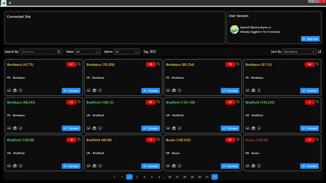 

**AIMS can log into any site in real-time for management (supports both P2P and NAT connection methods)**

 

**AIMS can search for sites based on attributes such as name and region**

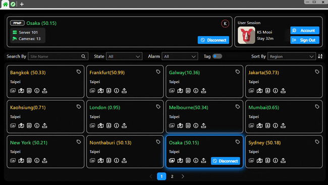 

### Features
Site Management simplifies the process of monitoring multiple NVR devices and cameras by allowing users to connect all devices with a single account. This feature provides an overview of site information, including geographic details, contact information, and camera cache photos, ensuring efficient site monitoring and management. Users can quickly check the status of each site and identify any connection issues with status filters.

## Application Menu

### Demos

**Provides five classification methods to manage over 40 application functions**

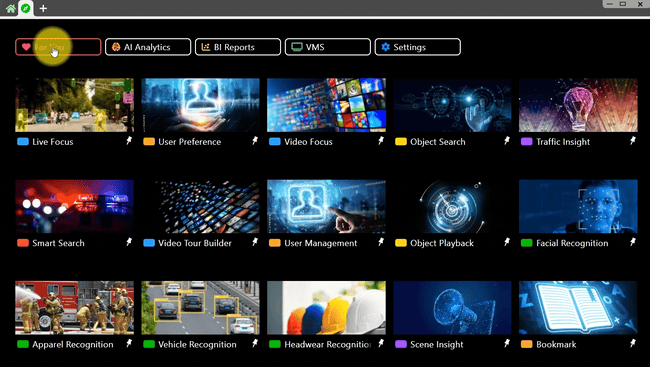 

**User-friendly browser interface that allows frequently used functions to be pinned on the Tab Panel**

 

**User-friendly browser interface that makes it easy to manage opened application functions**

 

### Features
The Application Menu offers an intuitive interface that categorizes all applications into common, AI analysis, BI reports, VMS, and settings. This organization helps users quickly find the applications they need. The menu is designed for ease of use, allowing even beginners to navigate effortlessly. Frequently used applications can be pinned for quick access, enhancing user efficiency.

## Video Focus

### Demos

**Easy and real-time design of video layouts with intuitive operation**

 

**User-friendly TimeBar function that allows easy search of video segments by time**

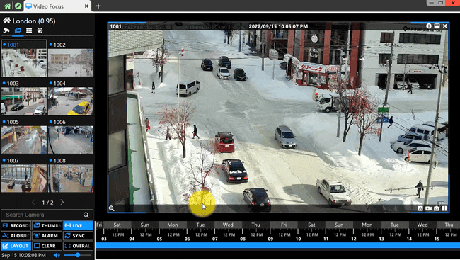 

**Provides four Video and Object Index functions to search video segments based on insights**

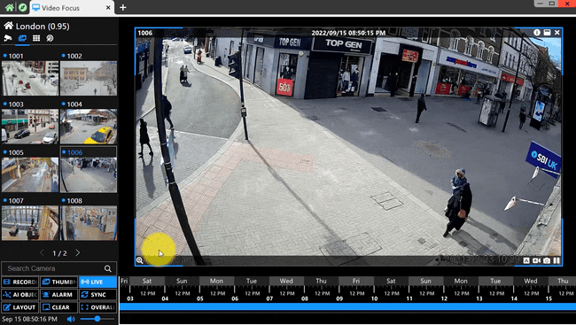 

**Provides Digital Zooming functionality for clear viewing of all image details**

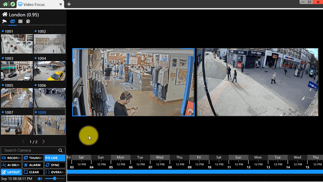 

**User-friendly PTZ operation functionality for directly controlling PTZ cameras on the Video Player**

### Features

Video Focus provides advanced tools for video manipulation, enabling users to efficiently find and manage video clips. It features timeline operations for easy viewing, intelligent statistical charts for event analysis, and PTZ camera controls for comprehensive video management. The interface allows users to change video layouts on the fly, ensuring a user-friendly experience.

## Mapbook

### Demos

**Monitor all camera images and object detection using geographic location**

 

**Monitor all AI analysis results using geographic location**

 

**Integrates 2D and 3D maps, allowing combined use of outdoor and indoor maps**

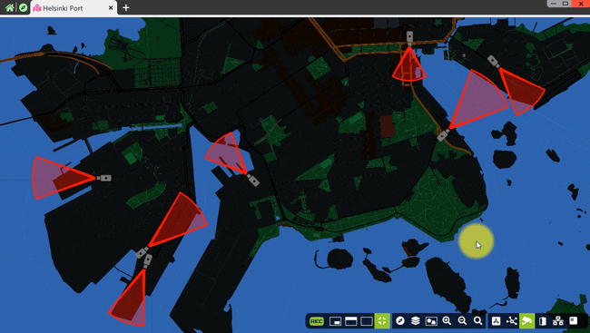 

**Supports multi-layered map creation**

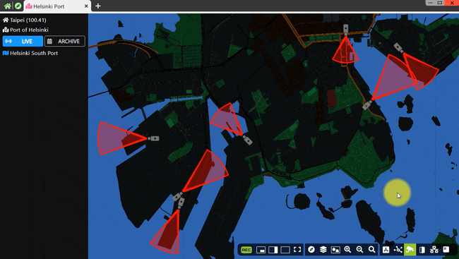 

**User-friendly map operation functions**

 

### Features
Mapbook integrates map information, camera positions, and analytics for precise monitoring of viewing areas. With an intuitive UI design, users can zoom, move the map, and switch between GIS information seamlessly. Mapbook combines indoor and outdoor map data, offering a comprehensive viewing experience that is easy to use and requires no learning curve.

## Bookmark

### Demos

**Bookmark management that supports multiple object detection**

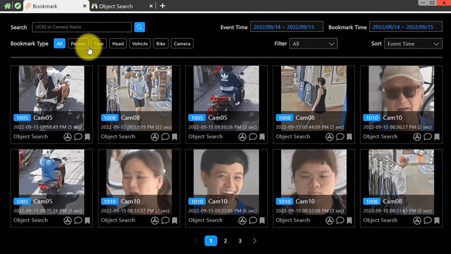 

**Provides multiple conditions for event searching**

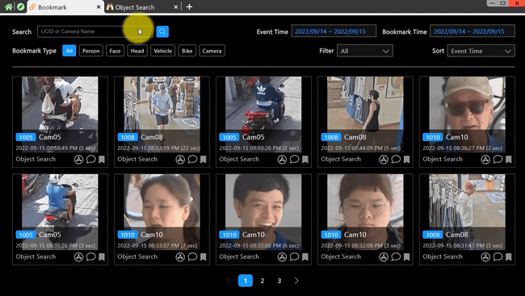 

**User-friendly tagging design allowing users to label various events**

 

**Users can annotate various events for easier subsequent processing**

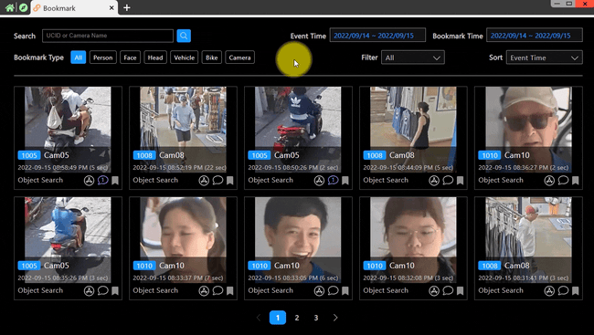 

### Features
Bookmark simplifies the process of marking and searching for key video segments. Users can tag detected objects or record video times for further review. This function makes it easy to track and document important events, reducing the time and effort required for security operators to find and analyze critical footage.

## Conclusion
In conclusion, AIMS brings together a suite of advanced features that transform how security operations are conducted. By providing an integrated system for site management, intuitive application navigation, sophisticated video manipulation, comprehensive mapping, and efficient bookmarking, AIMS enhances both the efficiency and effectiveness of surveillance activities. Users are empowered with tools that simplify complex tasks, improve response times, and ensure that critical events are captured and reviewed with ease. AIMS stands as a robust solution for modern security needs, offering unparalleled support to security operators and administrators.

