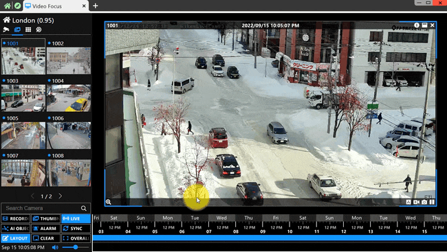
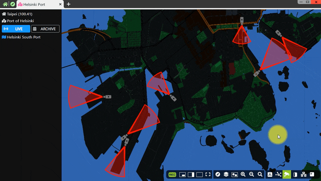
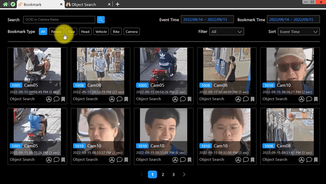

[ [English](aims_vms_features_enus.md) ] [ 繁體中文 ]

# 智能監控：深入了解 AIMS 的功能

## 介紹

AIMS 是為了提高安防操作的效率和效果而設計的。它整合了多種工具和功能，幫助無縫管理 NVR 設備、攝像機和視頻片段。使用 AIMS，用戶可以全面了解其監控環境，快速訪問重要信息並利用先進的分析能力。

AIMS 有幾個關鍵功能：
- 它可以同時管理超過 350 個站點。
- 每個站點可以監控和分析至少 800 支攝像機。
- AIMS 採用分散式架構設計，讓中控室可以即時掌控所有站點的連線狀態。
- 它支持 P2P 和 NAT 連線方式，確保安全且具成本效益的設置。

**Site Management**

AIMS 的 Site Management 功能允許用戶同時監控和控制超過 350 個站點。這一功能確保了所有站點連線狀態的即時監控，提供每個站點性能的全面概覽。用戶可以即時登錄任何站點進行管理，並支持 P2P 和 NAT 連線方式，確保操作的安全和高效。此外，可以根據名稱和區域等屬性搜索站點，方便地定位和管理特定站點。

**Application Menu**

AIMS 的 Application Menu 提供了一個直觀的界面，將超過 40 種應用功能分為五大類。這一用戶友好的瀏覽器界面允許用戶將常用功能固定在標籤面板上以便快速訪問。管理已打開的應用功能也變得簡單，因為該界面設計易於導航，即使是初學者也能輕鬆使用。這種組織方式幫助用戶快速找到並利用所需的應用，提高整體效率。

**Video Focus**

AIMS 的 Video Focus 提供了先進的視頻佈局設計和操作工具，使用戶能夠實時創建和修改視頻佈局，操作方式直觀。它具有用戶友好的時間條功能，允許根據時間輕鬆搜索視頻片段。此外，視頻聚焦提供四種視頻和物件索引功能，可根據洞察搜索視頻片段，還有數字縮放功能，清晰查看所有影像細節，以及直接在視頻播放器上控制 PTZ 攝像機的功能，確保全面的視頻管理。

**MapBook**

AIMS 的 MapBook 將地理信息與攝像機位置和分析結果整合，用於精確監控。這一功能允許用戶根據地理位置監控所有攝像機影像和物件偵測，以及查看 AI 分析結果。地圖書支持 2D 和 3D 地圖的整合，允許室外和室內地圖結合使用，並支持多圖層地圖創建。用戶友好的地圖操作功能使地圖縮放、移動和操作變得簡單，提供全面且直觀的地圖使用體驗。

**Bookmark**

AIMS 的 Bookmark 功能簡化了標記和搜索關鍵視頻片段的過程。它支持多種條件來搜索事件，並提供用戶友好的標籤設計，允許用戶為各種事件加上標籤，方便追踪和記錄。用戶還可以為事件添加註解，以便後續處理，使其成為安防操作員查找、分析和管理關鍵影像的高效工具。

本指南將解釋 AIMS 的主要組成部分，展示每個功能如何促進更用戶友好且強大的監控體驗。

# 精簡監控：深入了解 AIMS 的功能

## 介紹

AIMS 是為了提高安防操作的效率和效果而設計的。它整合了多種工具和功能，幫助無縫管理 NVR 設備、攝影機和視頻片段。使用 AIMS，用戶可以全面了解其監控環境，快速訪問重要信息並利用先進的分析能力。

AIMS 有幾個關鍵功能：
- 它可以同時管理超過 350 個站點。
- 每個站點可以監控和分析至少 800 支攝影機。
- AIMS 採用分散式架構設計，讓中控室可以即時掌控所有站點的連線狀態。
- 它支持 P2P 和 NAT 連線方式，確保安全且具成本效益的設置。

## Site Management

**AIMS 能同時管理超過 350 個站點 (即時掌握所有站點的連線狀態)**

 

**AIMS 能即時登入任一站點進行管理 (支援 P2P 和 NAT 兩種連線方式)**

 

**AIMS 可透過名稱、區域等屬性搜尋站點**

 

### 目的與用法
站點管理簡化了監控多個 NVR 設備和攝影機的過程，允許用戶使用單一帳戶連接所有設備。此功能提供了站點信息的概覽，包括地理詳情、聯絡信息和攝影機快取照片，確保高效的站點監控和管理。用戶可以快速檢查每個站點的狀態，並通過狀態過濾器識別任何連線問題。

## Application Menu

**提供五種分類方式來管理超過 40 種應用功能**

 

**提供人性化的瀏覽器操作介面，可以將常用功能固定在標籤面板上**

 

**提供人性化的瀏覽器操作介面，可以輕鬆管理已開啟的應用功能**

 

### 目的與用法
應用程序菜單提供了一個直觀的界面，將所有應用分為常用、AI 分析、BI 報告、VMS 和設置五大類。這種組織方式幫助用戶快速找到所需的應用。菜單設計簡單易用，讓初學者也能輕鬆導航。常用應用可以固定以便快速訪問，提高用戶效率。

## Video Focus

**能輕鬆且即時設計視頻佈局，操作方式直觀**

 

**提供人性化的時間條功能，能輕鬆根據時間搜尋視頻片段**

 

**提供四種視頻和物件索引功能，可以根據洞察搜尋視頻片段**

 

**提供數位縮放功能，能清晰看見所有影像細節**

 

**提供人性化的 PTZ 操作功能，能在視頻播放器上直接操控 PTZ 攝影機**

### 目的與用法
視頻聚焦提供了先進的視頻操作工具，使用戶能夠高效地查找和管理視頻片段。它具有時間線操作功能，便於觀看，智能統計圖表用於事件分析，以及 PTZ 攝影機控制功能，確保全面的視頻管理。界面允許用戶隨時更改視頻佈局，確保用戶友好的體驗。

## MapBook

**可以用地理位置監控所有攝影機的影像和物件偵測**

 

**可以用地理位置監控所有 AI 分析結果**

 

**整合 2D 與 3D 地圖，能將戶外與室內地圖結合使用**

 

**支援多圖層的地圖製作**

 

**提供人性化的地圖操作功能**

 

### 目的與用法
地圖書整合了地圖信息、攝影機位置和分析結果，用於精確監控觀看區域。具有直觀的 UI 設計，用戶可以輕鬆縮放、移動地圖並在 GIS 信息之間切換。地圖書結合了室內和室外的地圖數據，提供簡單易用的綜合觀看體驗，無需學習曲線。

## Bookmark

**支持多重物件偵測的書籤管理**

 

**提供多種條件來搜尋事件**

 

**提供人性化的標籤設計，讓用戶可以為各種事件加上標籤**

 

**用戶可以為各種事件加上註解，以便後續處理**

 

### 目的與用法
書籤簡化了標記和搜尋關鍵視頻片段的過程。用戶可以標記偵測到的物件或記錄視頻時間以便進一步查看。此功能使得追蹤和記錄重要事件變得容易，減少了安防操作員查找和分析關鍵影像所需的時間和精力。

## 結論
總而言之，AIMS 整合了一系列先進功能，改變了安防操作的進行方式。通過提供一個集成的站點管理系統、直觀的應用導航、先進的視頻操作、全面的地圖功能和高效的書籤管理，AIMS 提高了監控活動的效率和效果。用戶可以使用這些工具簡化複雜的任務，改善響應時間，並確保重要事件被捕捉和查看。AIMS 是現代安防需求的強大解決方案，為安防操作員和管理員提供了無與倫比的支持。

