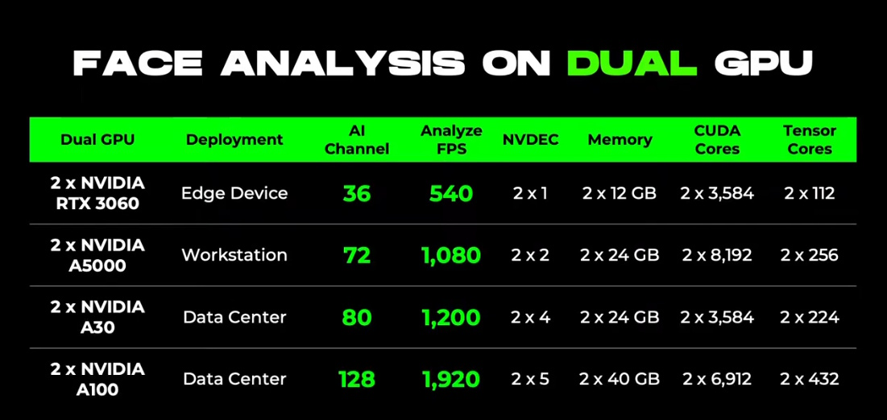

[ English ] [ [繁體中文](performance_insights_zhtw.md) ]

# Performance Insights: Video Analysis, Indexing, and Recording

## Introduction
In modern security surveillance systems, video analysis and recording are two crucial functions. These functions need to be performed simultaneously and in real-time, processing streams from multiple cameras. Thus, designing efficient application software to achieve this task becomes particularly important. This article will explore in detail how to optimize and enhance the performance of AI-driven video and image analysis systems under different GPU configurations.

In particular, efficient inference servers and efficient streaming servers play key roles in this process:

1. **Efficient Inference Servers**:
   - Capable of parallel decoding of multiple streams (H264/HEVC)
   - Parallel preprocessing of multiple streams (including resizing, color space conversion, and alignment)
   - Leveraging NVIDIA GPU acceleration technologies (such as TensorRT, CUDNN, and CUDA)
   - Optimizing video decoding, video preprocessing, AI inferencing, and post-processing to maximize performance
   - Supporting standard model formats like ONNX

2. **Efficient Streaming Servers**:
   - Parallel processing of streams from multiple cameras
   - Utilizing a highly efficient Async I/O system design to maximize performance
   - Using clip-based and object-based indexing to significantly enhance data search performance
   - Supporting mainstream and standard storage interfaces like SATA

This article provides detailed performance benchmarks of AI video and image analysis systems under various GPU configurations, assessing recording capabilities, data retention, and specific analysis features for facial recognition and person and vehicle identification. By analyzing different GPU configurations, the article highlights the advantages and limitations of each setup, offering key insights into how to optimize these systems for various deployment scenarios, including edge devices, workstations, and data centers. This information is crucial for professionals looking to improve the efficiency and effectiveness of AI-driven video analysis systems.

## Performance Benchmark on Dual GPU

<video src="res/demo_video/dual_gpu_performance.mp4" controls muted style="max-height:640px;"></video>

The following tables provide a detailed performance benchmark for dual GPU setups used in Face Analysis and Person & Vehicle Analysis. Each table highlights the deployment environment, AI channels, analysis frame rates (FPS), NVDEC units, memory capacity, CUDA cores, and Tensor cores for various NVIDIA GPU configurations. The data illustrates the significant performance improvements achieved with dual GPU configurations across different deployment scenarios such as edge devices, workstations, and data centers. These benchmarks are critical for understanding the capabilities of AI-driven video analysis systems in processing and analyzing high-resolution video streams efficiently.

### Sub-functions of Various AI Analyses

| Feature               | Face Analysis | Person Analysis | Vehicle Analysis |
|-----------------------|---------------|-----------------|------------------|
| HEVC/H264 Decoder     | V             | V               | V                |
| Face Detection        | V             |                 |                  |
| Mask Classification   | V             |                 |                  |
| Gender Classification | V             | V               |                  |
| Age Classification    | V             |                 |                  |
| Ethnicity Classification | V          |                 |                  |
| Face Recognition      | V             |                 |                  |
| Person Detection      |               | V               | V                |
| Upper Clothing Style Classification |  | V           |                  |
| Lower Clothing Style Classification |  | V           |                  |
| Upper Clothing Color Classification |  | V           |                  |
| Lower Clothing Color Classification |  | V           |                  |
| Person Identification (ReID) |        | V               |                  |
| Vehicle Type Classification |         |                 | V                |
| Vehicle Color Classification |        |                 | V                |
| Vehicle Recognition   |               |                 | V                |

### Performance Benchmark

| Dual GPU           | Deployment   | AI Channel | Analyze FPS | NVDEC   | Memory        | CUDA Cores       | Tensor Cores    |
|--------------------|--------------|------------|-------------|---------|---------------|------------------|-----------------|
| 2 x NVIDIA RTX 3060| Edge Device  | 36         | 540         | 2 x 1   | 2 x 12 GB     | 2 x 3,584        | 2 x 112         |
| 2 x NVIDIA A5000   | Workstation  | 72         | 1,080       | 2 x 2   | 2 x 24 GB     | 2 x 8,192        | 2 x 256         |
| 2 x NVIDIA A30     | Data Center  | 80         | 1,200       | 2 x 4   | 2 x 24 GB     | 2 x 3,584        | 2 x 224         |
| 2 x NVIDIA A100    | Data Center  | 128        | 1,920       | 2 x 5   | 2 x 40 GB     | 2 x 6,912        | 2 x 432         |

**Notes**
- HEVC video streaming (1920 x 1080, 15 FPS, 2 Mbps)
- H.264 video streaming (1920 x 1080, 15 FPS, 2 Mbps)

## Performance Benchmark on Single GPU

The following tables provide a comprehensive performance benchmark for single GPU configurations used in Face Analysis and Person & Vehicle Analysis. The tables present key metrics including deployment environment, AI channels, analysis frame rates (FPS), NVDEC units, memory capacity, CUDA cores, and Tensor cores for various NVIDIA GPUs. These benchmarks highlight the performance capabilities of different GPU models across various deployment scenarios such as edge devices, workstations, and data centers. The data demonstrates how each GPU configuration handles high-resolution video streams and complex AI processing tasks, providing critical insights for optimizing AI-driven video analysis systems.

### Performance Benchmark

| Single GPU         | Deployment   | AI Channel | Analyze FPS | NVDEC | Memory | CUDA Cores | Tensor Cores |
|--------------------|--------------|------------|-------------|-------|--------|------------|--------------|
| 1 x NVIDIA RTX 3060| Edge Device  | 18         | 270         | 1     | 12 GB  | 3,584      | 112          |
| 1 x NVIDIA A5000   | Workstation  | 36         | 540         | 2     | 24 GB  | 8,192      | 256          |
| 1 x NVIDIA A30     | Data Center  | 40         | 600         | 4     | 24 GB  | 3,584      | 224          |
| 1 x NVIDIA A100    | Data Center  | 60         | 900         | 5     | 40 GB  | 6,912      | 432          |

**Notes**
- HEVC video streaming (1920 x 1080, 15 FPS, 2 Mbps)
- H.264 video streaming (1920 x 1080, 15 FPS, 2 Mbps)

## 40 Cameras Recording

### Recording Functions and Data Rate

The tables below outline the recording functions, data rates, and storage arrangements for a system utilizing 40 cameras per server. The first table details the recording capabilities, showing that all 40 cameras can record video at a rate of 2 Mbps per camera and generate thumbnails at a rate of 8 images per minute per camera. However, due to GPU limitations, only 16 cameras can utilize the AI channel for analysis at 15 FPS per camera.

| Recording Function | 40 cameras / Server              | Data Rate               |
|--------------------|----------------------------------|-------------------------|
| Video              | All                              | 2 Mbps / Camera         |
| Thumbnail          | All                              | 8 image / min / Camera  |
| AI channel         | 16 (due to GPU limitation)       | 15 FPS / Camera         |
| Clip Indexing      | Yes (up to 100 clips/min)        | --                      |
| Object Indexing    | Yes (up to 300 objects/min)      | --                      |

### Storage Arrangement

The table provides the storage arrangement options, indicating how different HDD capacities affect the number of cameras per disk and the data retention period. For instance, a 6TB HDD can handle 4 cameras with a data retention period of 30 days, while a 10TB HDD can accommodate 3 cameras but with a longer retention period of 90 days. This information is essential for planning and optimizing storage solutions to meet specific recording and retention needs.

| HDD Capacity | Camera per Disk  | Data Retention |
|--------------|------------------|----------------|
| 6TB          | 4                | 30 days        |
| 8TB          | 3                | 60 days        |
| 12TB         | 4                | 60 days        |
| 10TB         | 3                | 90 days        |

**Notes**
- 40 cameras recording with 8 HDDs on SATA ports

## 24 Cameras Recording

### Recording Functions and Data Rate

The tables below describe the recording functions, data rates, and storage arrangements for a system using 24 cameras per server. The first table details the recording capabilities, showing that all 24 cameras can record video at a rate of 2 Mbps per camera and generate thumbnails at a rate of 8 images per minute per camera. Due to GPU limitations, the AI channel can only be used by 16 cameras, processing at 15 FPS per camera.

| Recording Function | 24 cameras / Server              | Data Rate               |
|--------------------|----------------------------------|-------------------------|
| Video              | All                              | 2 Mbps / Camera         |
| Thumbnail          | All                              | 8 image / min / Camera  |
| AI channel         | 16 (due to GPU limitation)       | 15 FPS / Camera         |
| Clip Indexing      | Yes (up to 100 clips/min)        | --                      |
| Object Indexing    | Yes (up to 300 objects/min)      | --                      |

### Storage Arrangement

The table provides various storage arrangement options, detailing how different HDD configurations affect the number of cameras per disk and the data retention period. For example, a configuration with 4TB x 5 + 2TB x 1 HDDs can support 3 cameras per disk with a data retention period of 30 days, while a setup with 12TB x 5 + 6TB x 1 HDDs also supports 3 cameras per disk but extends the retention period to 90 days. This information helps in planning and optimizing storage solutions based on specific recording and retention requirements.

| HDD Capacity        | Camera per Disk  | Data Retention |
|---------------------|------------------|----------------|
| 4TB x 5 + 2TB x 1   | 3 (recommended)  | 30 days        |
| 6TB x 4             | 4                | 30 days        |
| 8TB x 5 + 4TB x 1   | 3 (recommended)  | 60 days        |
| 12TB x 4            | 4                | 60 days        |
| 12TB x 5 + 6TB x 1  | 3                | 90 days        |

**Notes**
- 24 cameras recording with 6 HDDs on SATA ports

