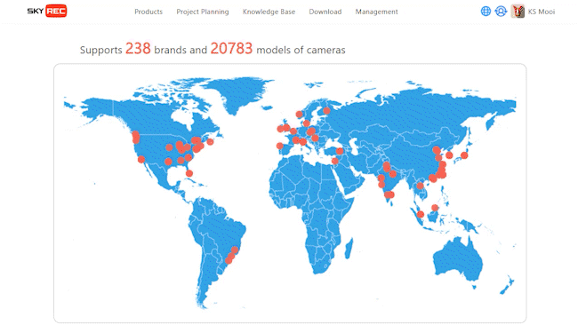
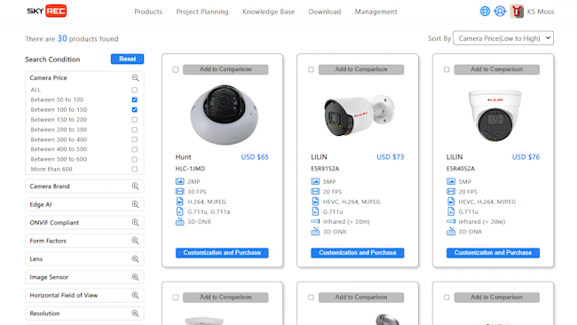
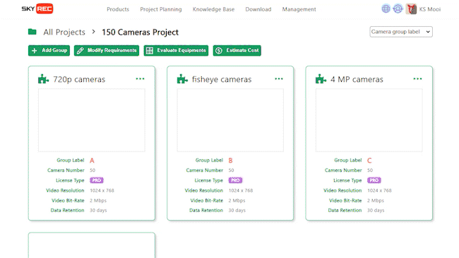
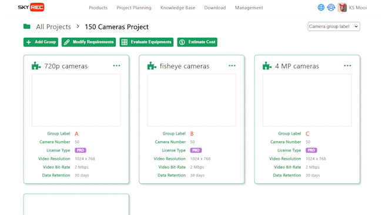

[ English ] [ [繁體中文](saas_msp_features_zhtw.md) ]

# SkyREC MSP: Combining Subscription Models and Cross-Border E-Commerce

SkyREC MSP (MemberShip Platform) is a powerful subscription platform that provides advanced AI software services to global enterprises. The AIMS software subscription function on the platform is flexible and diverse, meeting the needs of companies of different sizes. Users can choose between monthly or annual subscriptions based on their needs, enjoy automatic renewal services, and even access a free trial period to fully experience the software's features before purchasing. In addition to the subscription function, SkyREC MSP also offers detailed user guides and setup instructions to help users quickly get started and maximize their use of the software.

As a cross-border sales platform, SkyREC MSP offers a variety of AI servers and IP cameras in different specifications and grades to meet the needs of different application scenarios. The products sold on the platform cover a wide range of specifications and levels, and provide detailed technical information, user manuals, and installation guides. Users can easily make purchases through the platform and enjoy global logistics services, ensuring that products are delivered quickly and safely. The support of multiple payment methods, including T/T and credit cards, further enhances the convenience and security of purchasing.

The SkyREC MSP platform also features powerful project analysis and planning tools to help enterprises plan projects according to specific needs. These tools can recommend the most suitable cameras, AI servers, and their accompanying hardware specifications based on conditions such as object detection types, image resolution, FPS, recording days, and image analysis quantities, and calculate the total cost of the overall plan. The platform's Knowledge Base provides complete technical documents and user guides, ensuring users receive comprehensive support and guidance during use. These feature functions make SkyREC MSP the ideal choice for enterprises to enhance their competitiveness and operational efficiency in the global market.

## Platform Function Overview

1. **Membership Management:**
   - Offers flexible membership systems where members can choose different levels of service according to their needs.
   - Members can enjoy exclusive discounts, professional technical support, and other value-added services.

2. **AIMS Software Subscription:**
   - Provides various subscription plans to meet the needs of enterprises of different scales.
   - Users can choose monthly or annual subscriptions and enjoy automatic renewal services.
   - Offers a free trial period for users to experience the software's features before purchasing.

3. **Diverse Product Sales:**
   - Sells AI servers of various specifications and grades to meet different application needs.
   - Sells IP cameras of various specifications and grades, providing high-quality monitoring solutions.
   - Provides detailed technical information, user manuals, and installation guides.

4. **Project Analysis and Planning Tools:**
   - Provides various conditions to plan projects and select suitable cameras, AI servers, and AI software.
   - Analysis conditions include object detection types, image resolution, FPS, recording days, and image analysis quantities.
   - The tools ultimately produce:
     - Recommended camera brands and quantities.
     - Recommended AI server brands and quantities.
     - HDD specifications and quantities for each AI server (considering image analysis and recording needs).
     - Allocation of cameras to each AI server (considering image analysis and recording needs).

5. **Comprehensive Product Search Function:**
   - Provides 20 conditions to search for suitable cameras, such as price, brand, case type, lens type, ONVIF profile, etc.
   - Provides 5 conditions to search for suitable cameras, such as price, recording days, image analysis quantities, etc.

6. **Flexible Payment Methods:**
   - Supports various payment methods, including T/T (wire transfer) and credit cards (VISA, MasterCard), making it convenient for global users to pay.
   - Provides a secure payment environment, ensuring the safety of users' payment information.

7. **Global Logistics and Delivery:**
   - Supports global logistics and delivery, ensuring that products are delivered quickly and safely to users.
   - Provides order tracking services, allowing users to check the status and logistics information of their orders at any time.

8. **Complete Product and Technical Documentation:**
   - Provides detailed technical documents such as AI software user guides, AI software setup guides, camera installation guides, and AI server installation guides.

9. **Data Analysis and Reporting:**
   - Provides detailed data analysis functions to help users understand the usage of software and hardware.
   - Customizable report generation functions to assist users in decision-making and optimizing operations.

10. **Multilingual and Localization Support:**
    - Provides multilingual support to meet the needs of users from different countries and regions.
    - Localized customer service and technical support, providing services closer to users.

## Platform Function Demonstration

**AI Software Features and Subscription Functions**

 

---
**AI Server Features and Procurement Functions**

 

---
**IP Camera Features and Procurement Functions**

 

---
**AI Software Compatible IP Camera Brands Over 238, Models Over 20738**

 

---
**Project Analysis and Planning Tools: Key Planning Functions for Each Project**

 

---
**Project Analysis and Planning Tools: Calculating the Total Cost of the Overall Plan**

 

---
**Project Analysis and Planning Tools: Detailed Hardware Specifications for Each AI Server**

 

---
**Project Analysis and Planning Tools: Quantity and Models of IP Cameras Allocated to Each AI Server**

 

---
**Project Analysis and Planning Tools: Quantity and Specifications of HDDs Allocated to Each AI Server**

 

---
**Knowledge Base: Comprehensive Technical Documents for Project Design and Planning**

 

---
**Knowledge Base: Complete AI Software User Manuals**

 
