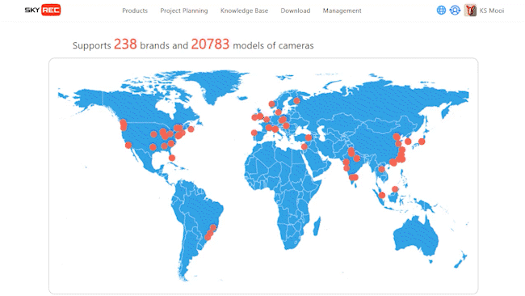
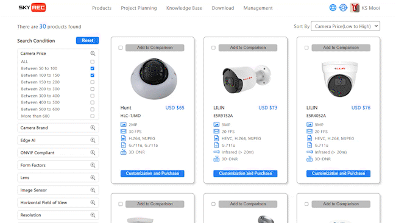
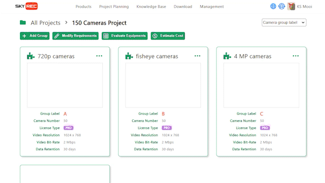
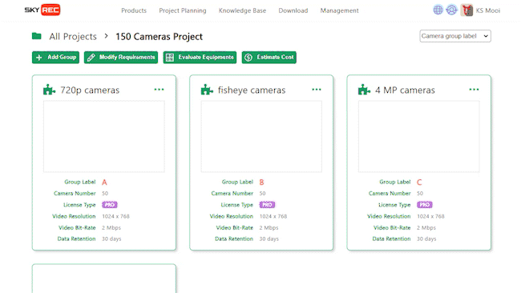

[ [English](saas_msp_features_enus.md) ] [ 繁體中文 ]

# SkyREC MSP：訂閱模式與跨境電商的結合

SkyREC MSP (MemberShip Platform) 是一個功能強大的訂閱平台，專為全球企業提供先進的 AI 軟體服務。平台上的 AIMS 軟體訂閱功能靈活多樣，滿足不同規模和需求的企業。用戶可以根據需求選擇月訂閱或年訂閱，並享受自動續訂服務，還提供免費試用期，讓用戶在購買前能夠全面體驗軟體功能。除了訂閱功能外，SkyREC MSP 還提供詳細的使用指南和設置指南，幫助用戶快速上手並最大化地利用軟體功能。

作為一個跨境銷售平台，SkyREC MSP 提供多樣化的 AI 伺服器和 IP 攝像頭產品，滿足不同應用場景的需求。平台上銷售的產品涵蓋多種規格與等級，並提供詳細的技術資料、使用說明和安裝指南。用戶可以輕鬆地通過平台進行採購，並享受全球範圍內的物流配送服務，確保產品能夠快速、安全地送達。多種支付方式的支持，包括 T/T 和信用卡，進一步提升了購買的便利性和安全性。

SkyREC MSP 平台還擁有強大的專案分析與規劃工具，幫助企業根據具體需求規劃專案。這些工具可以根據物件偵測的種類、影像解析度、影像 FPS、錄影天數等條件，推薦最合適的攝影機、AI 伺服器及其配套的硬體規格，並計算整體規劃的總成本。平台的 Knowledge Base 提供完整的技術文件和使用者指南，確保用戶在使用過程中得到全面的支持和指導。這些特色功能使 SkyREC MSP 成為企業在全球市場中提升競爭力和運營效率的理想選擇。

## 平台功能簡介

1. **會員制管理：**
   - 提供靈活的會員制度，會員可根據需求選擇不同等級的服務。
   - 會員可享受專屬優惠、專業技術支持及其他增值服務。

2. **AIMS 軟體訂閱：**
   - 提供多種訂閱方案，滿足不同規模和需求的企業。
   - 用戶可根據需要選擇月訂閱或年訂閱，並享受自動續訂服務。
   - 提供免費試用期，讓用戶在購買前體驗軟體功能。

3. **多樣化產品銷售：**
   - 銷售多種不同規格與等級的 AI 伺服器，滿足不同應用場景的需求。
   - 銷售多種不同規格與等級的 IP 攝像頭，提供高質量的監控解決方案。
   - 提供詳細的產品技術資料、使用說明和安裝指南。

4. **專案分析與規劃工具：**
   - 提供多種條件來規劃專案，並選擇合適的攝影機、AI 伺服器、AI 軟體。
   - 分析條件包括物件偵測的種類、影像解析度、影像 FPS、錄影天數、影像分析數量等。
   - 工具最終會產出：
     - 推薦的攝影機品牌與數量。
     - 推薦的 AI 伺服器品牌與數量。
     - 每台 AI 伺服器所配搭的 HDD 規格與數量（考量影像分析與錄影需求）。
     - 每台 AI 伺服器所分配的攝影機（考量影像分析與錄影需求）。

5. **完整的產品搜尋功能：**
   - 提供 20 種條件來搜尋合適的攝影機，如價格、品牌、機殼類型、鏡頭類型、ONVIF Profile 等。
   - 提供 5 種條件來搜尋合適的攝影機，如價格、錄影天數、影像分析數量等。

6. **靈活的支付方式：**
   - 支持多種支付方式，包括 T/T（電匯）和信用卡（VISA, Master），方便全球用戶支付。
   - 提供安全的支付環境，保障用戶的支付信息安全。

7. **全球物流與配送：**
   - 支持全球範圍內的物流配送，確保產品能夠快速、安全地送達用戶手中。
   - 提供訂單跟蹤服務，用戶可以隨時查看訂單狀態和物流信息。

8. **完整的產品與技術文件：**
   - 提供 AI 軟體使用指南、AI 軟體設置指南、攝像頭安裝指南、AI 伺服器安裝指南等詳細技術文件。

9. **數據分析與報告：**
   - 提供詳細的數據分析功能，幫助用戶了解軟體和硬件的使用情況。
   - 自定義報告生成功能，便於用戶進行決策和優化運營。

10. **多語言和本地化支持：**
   - 提供多語言支持，滿足不同國家和地區用戶的需求。
   - 本地化客服和技術支持，提供更貼近用戶的服務。

## 平台功能演示

**AI Software 軟體的特色介紹與訂閱功能**

 

---
**AI Server 的特色介紹與採購功能**

 

---
**IP Camera 的特色介紹與採購功能**

 

---
**AI Software 相容的 IP Camera 品牌超過 238 個，型號超過 20738 個**

 

---
**專案分析與規劃工具：每個專案的主要規劃功能**

 

---
**專案分析與規劃工具：計算整體規劃的總成本**

 

---
**專案分析與規劃工具：每台 AI Server 的詳細硬體規格**

 

---
**專案分析與規劃工具：每台 AI Server 所搭配的 IP Camera 數量與型號**

 

---
**專案分析與規劃工具：每台 AI Server 所搭配的 HDD 數量與規格**

 

---
**Knowledge Base：提供完整的專案設計與規劃技術文件**

 

---
**Knowledge Base：提供完整的 AI Software 使用者文件**

 

